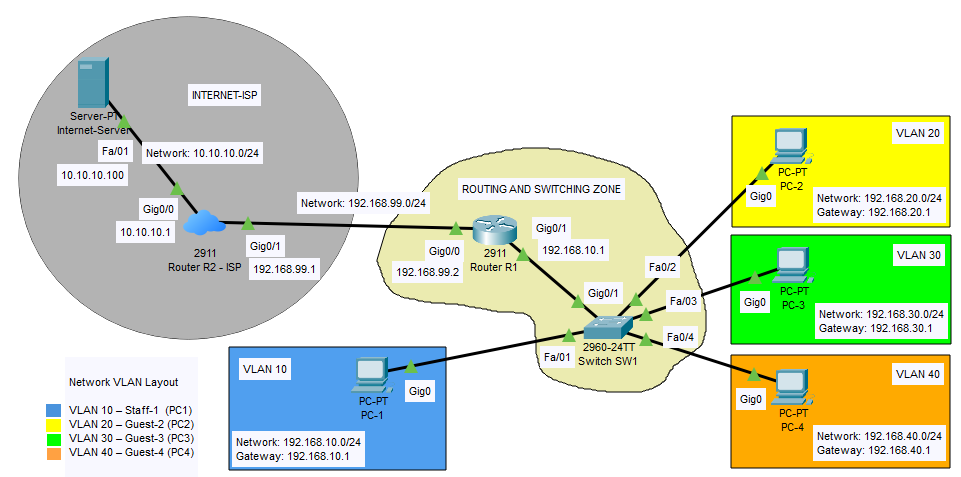

# **1 – Síťová topologie a použitá zařízení**

## 1.1 – Úvod

Topologie této sítě byla navržena tak, aby věrně simulovala provoz malé firemní sítě s přístupem k Internetu. Obsahuje čtyři počítače připojené přes switch, směrování mezi VLAN pomocí centrálního routeru R1, druhý router simulující modem poskytovatele internetu (ISP) a server poskytující internetové služby.

**Router R1** hraje klíčovou roli jako centrální prvek vnitřní sítě – zajišťuje směrování mezi VLANami a provádí NAT/PAT pro přístup směrem ven.  
**Router R2** slouží jako simulovaný poskytovatel připojení k Internetu (ISP) a tvoří hranici mezi interní sítí a „vnějším světem“.  
**Server**, připojený za routerem R2 v samostatné síti, simuluje internetové služby – poskytuje **DNS (překlad domén)** a **HTTP (webový obsah)**, čímž umožňuje testování plného síťového provozu z interních VLAN.

Celá síť tak umožňuje otestovat realistický provoz mezi oddělenými VLANami s přístupem k simulovanému Internetu.

**Důležitý poznatek:** Projekt je koncipován čistě jako ukázka kabelové infrastruktury – Wi-Fi zde není součástí budované sítě. Cílem je ukázat stabilní, spolehlivou a zabezpečenou strukturu pevné sítě, která je ideální pro prezentaci konfigurací a výukových účelu v oblasti CNNA I.

## 1.2 – Použitá zařízení

| Typ zařízení     | Model             | Využití v síti                                                                                                                                                                                                                              |
| ---------------- | ----------------- | ------------------------------------------------------------------------------------------------------------------------------------------------------------------------------------------------------------------------------------------- |
| **Router R1**    | Cisco 2911        | Hlavní směrovač a brána do vnitřní sítě. Zajišťuje komunikaci mezi VLAN a přístup směrem na hraniční router R2. Provádí NAT/PAT pro odchozí provoz z interních VLAN. Má dva gigabitové porty pro propojení se switchem SW1 a s routerem R2. |
| **Router R2**    | Cisco 2911        | Hraniční router simulující připojení k ISP.   Odděluje interní síť kavárny od sítě se serverem.   Připojen k R1 , má statické trasy zpět do VLAN.                                                                               |
| **Switch SW1**   | Cisco 2960-24TT   | Univerzální přepínač vhodný pro většinu labů v rámci CCNA I. Podporuje VLAN, port security i různé typy portů (Gigabit/FastEthernet).                                                                                                       |
| **PC-1 až PC-4** | PC-PT (defaultní) | Pracovní stanice rozmístěné ve VLAN. Každý PC má přidaný modul PT-HOST-NM-1CGE s gigabitovým portem Gig0 pro kvalitní připojení k páteřní síti i vyšší rychlost.                                                                            |
| **Server**       | Server-PT         | Server simulující internetové služby (DNS, HTTP) pro testování připojení z VLAN.   Připojen k R2 .                                                                                                                                       |

 V celé síti jsem použil straight-through měděné kabely, které jsou standardní volbou pro propojení rozdílných zařízení (např. router R1↔ switch SW1, switch SW1 ↔ PC).

## 1.3 – Přehled topologie – fyzická propojení

| Zařízení   | Rozhraní | Připojeno k | Rozhraní (peer) | Poznámka                                     |
| ---------- | -------- | ----------- | --------------- | -------------------------------------------- |
| Router R1  | Gig0/1   | Switch SW1  | Gig0/1          | Hlavní propojení mezi switchem a routerem R1 |
| Router R1  | Gig0/0   | Router R2   | Gig0/1          | Směrování k hraničnímu routeru (ISP)         |
| Router R2  | Gig0/1   | Router R1   | Gig0/0          | Směrování do vnitřní sítě                    |
| Router R2  | Gig0/0   | Server      | Fa0             | Připojení k síti s DNS a HTTP službami       |
| Switch SW1 | Gig0/1   | Router R1   | Gig0/1          | Hlavní spojení mezi switchem a routerem      |
| Switch SW1 | Fa0/1    | PC-1        | Gig0            | VLAN 10                                      |
| Switch SW1 | Fa0/2    | PC-2        | Gig0            | VLAN 20                                      |
| Switch SW1 | Fa0/3    | PC-3        | Gig0            | VLAN 30                                      |
| Switch SW1 | Fa0/4    | PC-4        | Gig0            | VLAN 40                                      |
| PC-1 až 4  | Gig0     | Switch SW1  | Fa0/1–Fa0/4     | Podle přiřazení VLAN                         |
| Server     | Fa0      | Router R2   | Gig0/0          | Simulovaná internetová síť                   |

## 1.4 – Pojmenování zařízení přes Display Name

Pro lepší orientaci v topologii byla všem zařízením v síti nastavena hodnota **Display Name**. Nastavení probíhalo u každého zařízení v rozhraní:

`Config -> Global Settings -> Display Name`

Zařízení, která nepodporují CLI rozhraní (např. PC-PT, Server-PT), nemohou mít nastavený hostname příkazem. U těchto zařízení byla tedy použita výhradně možnost pojmenování přes GUI.

**Display Name přehled:**

- Router-PT (Router R1) – **Router R1**
    
- Router-PT (Router R2) – **Router R2 - ISP**
    
- Switch-PT – **Switch SW1**
    
- PC-PT (PC1) – **PC-1**
    
- PC-PT (PC2) – **PC-2**
    
- PC-PT (PC3) – **PC-3**
    
- PC-PT (PC4) – **PC-4**
    
- Server-PT – **Internet-Server**
    

>**Poznámka:** Nastavení Display Name nijak neovlivňuje funkčnost sítě. Slouží pouze pro vizuální přehlednost v GUI.

---

Pokračovat na další kapitolu: [Adresní a VLAN plánování](02-adresni-a-vlan-planovani.md)

