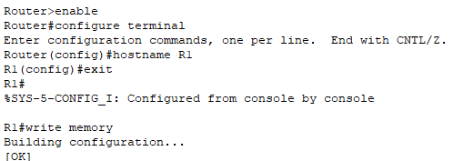

# **3 – Základní síťová konfigurace**

## 3.1 – Úvod

Tato kapitola se zaměřuje na základní síťovou konfiguraci, která připraví prostředí pro další kroky projektu. Provedeme pojmenování zařízení pro lepší orientaci, nastavíme statické IP adresy na routerech i počítačích a nakonfigurujeme propojení mezi routery R1 a R2. Tyto kroky tvoří nezbytný základ pro budoucí konfiguraci VLAN a směrování.
## 3.2 – Pojmenování zařízení

V první části této kapitoly nastavíme názvy (hostname) všem zařízením, která mají přístup do rozhraní CLI. Tím zlepšíme orientaci v síti a pozdější konfigurace bude přehlednější.

### Router R2 

- Hostname: `R2-NET`
    
- Slouží jako hraniční router mezi vnitřní sítí a serverem, který v projektu simuluje připojení k Internetu. 
    
- Router R1 směruje provoz z VLAN do R2 (rozhraní GigabitEthernet0/1) a R2 jej následně přeposílá k serveru.

```
enable
configure terminal
hostname R2-NET
exit
write memory
```

### Router R1 

- Hostname: `R1`
    
- Spojuje naši vnitřní síť s routerem R2 a provádí překlad adres (NAT/PAT) pro přístup vnitřních VLAN k serveru.


```
enable
configure terminal
hostname R1
exit
write memory
```

### Switch SW1

- Hostname: `SW1`
    

```
enable
configure terminal
hostname SW1
exit
write memory
```
###### 


## 3.3 – Nastavení statických IP adres na routerech

Podle plánovací tabulky z kapitoly 3 nastavíme IP adresy pro routery. 
Každé zařízení dostane IP adresu, která odpovídá jeho budoucímu přiřazení do VLAN. Maska je ve všech případech /24 (255.255.255.0).

### Router R2 (hraniční router celé sítě)

Na rozhraní `GigabitEthernet0/1` nastavíme IP adresu `192.168.99.1`.

```
enable
configure terminal
interface gigabitethernet0/1
ip address 192.168.99.1 255.255.255.0
no shutdown
end
write memory
```

>**Poznámka:** Router R2 simuluje poskytovatele internetu (ISP) a je propojen se serverem, který simuluje Internetové služby. Nemá výchozí bránu a funguje jako konečný bod směrem k serveru.
### Router R1 – propojení s R2 a aktivace portu se switchem

- `Gig0/0`: Komunikuje s R2 (adresa `192.168.99.2`)
    
- `Gig0/1`: Zatím jen aktivujeme, použije se později pro VLANy
    

```
enable
configure terminal
interface gigabitethernet0/0
ip address 192.168.99.2 255.255.255.0
no shutdown
exit
interface gigabitethernet0/1
no shutdown
exit
end
write memory
```

> **Poznámka:** IP adresa `192.168.10.1` (výchozí brána pro PC-1) bude nastavena až v další kapitole v rámci subrozhraní `Gig0/1.10`, protože bude součástí VLAN 10. Budeme používat Router-on-a-Stick s trunkem.

### Potvrzení nastavení IP adresy na routeru R1

Pro ověření, že byla IP adresa správně nastavena na rozhraní routeru R1, jsme použili jednoduchou diagnostiku pomocí příkazu:

```
show ip interface brief
```


Tento příkaz zobrazí přehled všech rozhraní a jejich IP adres. Na výstupu jsme zkontrolovali, že rozhraní `GigabitEthernet0/0` má IP adresu `192.168.99.2` a je ve stavu `up`.

> **Poznámka:** Tento příkaz je ideální pro rychlé ověření stavu rozhraní a nastavených IP adres na routeru. Výstup obsahuje sloupce jako Interface, IP-Address, OK?, Method, Status a Protocol.


## 3.4 – Statické IP adresy na PC

Nastavujeme ručně IP adresy na všech PC pomocí grafického rozhraní v záložce **Desktop → IP Configuration**. IP adresy odpovídají rozdělení do budoucích VLAN.


###  PC-1 – Zaměstnanci (staff)

- IP: `192.168.10.10`
    
- Maska: `255.255.255.0`
    
- Brána: `192.168.10.1`


Pomocí příkazu `ipconfig` jsme ověřili, že konfigurace byla úspěšně nastavena.


### PC-2 – Host (guest)

- IP: `192.168.20.10`
    
- Maska: `255.255.255.0`
    
- Brána: `192.168.20.1`


### PC-3 – Host (guest)

- IP: `192.168.30.10`
    
- Maska: `255.255.255.0`
    
- Brána: `192.168.30.1`


### PC-4 – Host (guest)

- IP: `192.168.40.10`
    
- Maska: `255.255.255.0`
    
- Brána: `192.168.40.1`


Každému PC jsme nastavili potřebné IP adresy, masky a výchozí brány pro budoucí rozdělení sítě pomocí VLAN.

>**Poznámka:** Konfigurace přes CLI není možná, protože PC v Packet Traceru nemají IOS. Nastavení však můžete ověřit pomocí příkazu `ipconfig` v **Příkazovém řádku**.

## 3.5 – Shrnutí

V této kapitole jsme pojmenovali všechna síťová zařízení a nastavili jejich statické IP adresy podle adresního plánu. Routery R1 a R2 jsme propojili v rámci samostatného propojení, které v projektu slouží jako přechod mezi vnitřní sítí a serverem simulujícím internet. V této fázi ještě není mezi jednotlivými PC nastavena vzájemná komunikace, protože VLANy budou konfigurovány až v další kapitole.

Pokračuj na další kapitolu: [VLANy a subinterface](04-vlany-a-subinterface.md)
