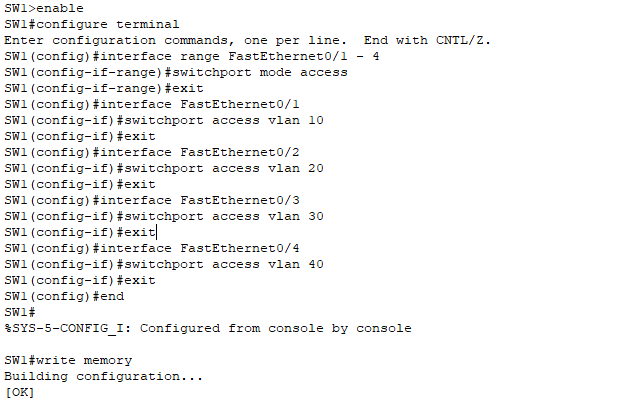

# 4 – **Vlany a subinterface**


## 4.1 - Úvod

V této kapitole se pustíme do konfigurace virtuálních LAN (VLAN-Virtual Local Area Network) a směrování mezi nimi pomocí technologie **Router-on-a-Stick**. Jde o klíčový krok pro oddělení síťového provozu mezi zaměstnanci a hosty, přičemž komunikace mezi jednotlivými segmenty bude procházet centrálním routerem R1. 

Na switchi SW1 vytvoříme jednotlivé VLANy, přiřadíme jim porty, nakonfigurujeme trunk port a na routeru nastavíme subrozhraní, která se postarají o směrování. Tím vytvoříme přehlednou a bezpečnou síť.


## 4.2 - Vytvoření VLAN na switchi SW1

Abychom mohli síť rozdělit do logických segmentů (např. zaměstnanci, hosté), musíme nejprve na přepínači SW1 vytvořit jednotlivé VLANy. Každá VLAN bude mít vlastní ID a název, který zjednoduší orientaci v konfiguraci.

Na přepínači (switch) vytvoříme následující VLANy:

| VLAN ID | Název    | Popis                   |
| ------- | -------- | ----------------------- |
| 10      | Staff-1  | Zaměstnanci (PC-1)      |
| 20      | Guest-2  | Hosté (PC-2)            |
| 30      | Guest-3  | Hosté (PC-3)            |
| 40      | Guest-4  | Hosté (PC-4)            |

Pro každou VLAN použijeme jednoduchý příkaz `vlan <ID>` a nastavíme název pomocí `name`.


```
enable
configure terminal
vlan 10
name Staff-1
vlan 20
name Guest-2
vlan 30
name Guest-3
vlan 40
name Guest-4
exit
write memory
```


 > **Poznámka**: VLAN 10 označujeme jako „Staff-1“ a slouží pro zaměstnance – konkrétně PC-1, který je zároveň ve stejné podsíti jako router R1.


## 4.3 - Přiřazení portů do VLAN

Po vytvoření jednotlivých VLAN je nutné určit, které fyzické porty přepínače SW1 budou přiřazeny ke kterým VLANám. Tím zajistíme, že konkrétní zařízení bude patřit do správného síťového segmentu.

### Přiřazení portů

|Port SW1|VLAN|Popis|Připojeno zařízení|
|---|---|---|---|
|FastEthernet0/1|10|Staff-1|PC-1 (zaměstnanec)|
|FastEthernet0/2|20|Guest-2|PC-2 (host)|
|FastEthernet0/3|30|Guest-3|PC-3 (host)|
|FastEthernet0/4|40|Guest-4|PC-4 (host)|

Každý port na switchi může být přiřazen pouze do jedné přístupové VLAN (access VLAN).

Na switchi jsme pomocí příkazu `interface range FastEthernet0/1 - 4` zahájili hromadnou konfiguraci portů FastEthernet 0/1 až 0/4, abychom je mohli přepnout do režimu access a přiřadit k příslušným VLAN.

```
enable
configure terminal
interface range FastEthernet0/1 - 4
switchport mode access
exit
interface FastEthernet0/1
switchport access vlan 10
exit
interface FastEthernet0/2
switchport access vlan 20
exit
interface FastEthernet0/3
switchport access vlan 30
exit
interface FastEthernet0/4
switchport access vlan 40
exit
write memory
```


>**Poznámka**: Každé zařízení je odděleno ve vlastní VLAN. To zvyšuje bezpečnost a zajišťuje lepší kontrolu nad síťovým provozem. VLAN 10 (PC-1) je ve stejné podsíti jako subrozhraní `GigabitEthernet0/1.10` na routeru R1, což bude její výchozí brána.

### Ověření přiřazení portů k VLAN na switchi

Pro ověření, že porty na switchi byly správně přiřazeny k jednotlivým VLANám, jsme použili jednoduchou diagnostiku pomocí příkazu:

```
show vlan brief
```


Tento příkaz nám ukazuje přehled názvů všech VLAN a přiřazených portů. Na výstupu jsme zkontrolovali, že porty `Fa0/1` až `Fa0/4` byly správně přiřazeny ke VLANám 10, 20, 30 a 40 a že jsou aktivní.


## 4.4 - Nastavení trunk portu na SW1

Pro zajištění komunikace mezi VLANami a směrování přes router R1 potřebujeme, aby přepínač SW1 přenášel rámce všech VLAN směrem k routeru. K tomu použijeme tzv. **trunk port**.

### Propojení Trunku

| Port SW1           | Typ portu | Popis                   |
| ------------------ | --------- | ----------------------- |
| GigabitEthernet0/1 | trunk     | Spojení SW1 ↔ Router R1 |

- Trunk port umožní přenášet více VLAN přes jeden fyzický kabel
    
- Pro aktivaci trunk režimu použijeme příkaz: 

`switchport mode trunk` 

```
enable
configure terminal
interface GigabitEthernet0/1
switchport mode trunk
exit
write memory
```


>**Poznámka:** Příkaz `no shutdown` nebyl potřeba, protože port `GigabitEthernet0/1` je na switchi ve výchozím stavu aktivní,

### Diagnostika trunk portu (GigabitEthernet0/1)

Pro ověření, že port `GigabitEthernet0/1` na přepínači SW1 skutečně funguje jako trunk a přenáší požadované VLANy, jsme použili následující příkaz:

`show interfaces trunk`


**Výstup potvrzuje:**

- Port `Gig0/1` je v režimu **trunk**
    
- Používá **encapsulation 802.1Q**
    
- Jsou povoleny a aktivní všechny potřebné VLANy: **1, 10, 20, 30, 40, 
    
- Port je ve stavu **forwarding** a **nebyl pruned** (tedy žádná VLAN nebyla vynechána)


## 4.5 - Subrozhraní na R1 (Router-on-a-Stick)

Aby mohly jednotlivé VLANy mezi sebou komunikovat a měly přístup k internetu, je třeba na routeru R1 vytvořit tzv. **subrozhraní**. Jedná se o logická rozhraní vytvořená nad jedním fyzickým portem `GigabitEthernet0/1`, který je propojen se switchem SW1 pomocí trunk portu.

Každé subrozhraní bude reprezentovat jednu VLAN, bude mít svou IP adresu (výchozí bránu pro danou VLAN) a bude označeno ve formátu `GigabitEthernet0/1.X`, kde `X` je VLAN ID.

### Přehled subrozhraní:

| Subrozhraní           | VLAN | IP adresa (brána) | Síť             |
| --------------------- | ---- | ----------------- | --------------- |
| GigabitEthernet0/1.10 | 10   | 192.168.10.1      | 192.168.10.0/24 |
| GigabitEthernet0/1.20 | 20   | 192.168.20.1      | 192.168.20.0/24 |
| GigabitEthernet0/1.30 | 30   | 192.168.30.1      | 192.168.30.0/24 |
| GigabitEthernet0/1.40 | 40   | 192.168.40.1      | 192.168.40.0/24 |


Každé subrozhraní musí mít:

- označení pomocí `encapsulation dot1Q <VLAN ID>`
    
- nakonfigurování s příslušnou IP adresou
    
- aktivování pomocí `no shutdown`

**Konfigurace na routeru R1:**

```
enable
configure terminal
interface GigabitEthernet0/1.10
encapsulation dot1Q 10
ip address 192.168.10.1 255.255.255.0
no shutdown
exit
interface GigabitEthernet0/1.20
encapsulation dot1Q 20
ip address 192.168.20.1 255.255.255.0
no shutdown
exit
interface GigabitEthernet0/1.30
encapsulation dot1Q 30
ip address 192.168.30.1 255.255.255.0
no shutdown
exit
interface GigabitEthernet0/1.40
encapsulation dot1Q 40
ip address 192.168.40.1 255.255.255.0
no shutdown
exit
write memory
```


Tímto jsme nakonfigurovali všechna potřebná subrozhraní na R1 pro jednotlivé VLANy a router je nyní připraven směrovat provoz mezi nimi.

### Diagnostika subrozhraní

Pro ověření, že jsou všechna subrozhraní na portu **GigabitEthernet0/1** (pro VLANy 10–40) aktivní a správně nakonfigurovaná.

Diagnostiku provedeme pomocí příkazu: `show ip interface brief`


Výstup potvrzuje:

- Subrozhraní **G0/1.10 až G0/1.40** jsou aktivní (`up/up`)
    
- Každé subrozhraní má správnou **IP adresu** dle své VLAN
    
- Port **G0/1** (bez IP) slouží jako základní fyzické rozhraní pro subrozhraní
    
- Port **G0/0** (192.168.99.2) je propojen s **R2** pro NAT/PAT
    
- Ostatní rozhraní nejsou použita


## 4.6 -  Diagnostika konektivity


Pro ověření správného směrování jsme provedli testy pomocí příkazů `ping` z různých zařízení:

- **Z PC-1** (VLAN 10) jsme úspěšně pingli všechny ostatní PC-2 až PC-4
    
- **Z Routeru R1 jsme pingli všechny zařízení ve VLANách – přístup do všech podsítí funguje

**Použijeme příkaz:** `ping (PC-1)`

```
192.168.20.10 (PC-2)
192.168.30.10 (PC-3)
192.168.40.10 (PC-4)
```


Použijeme příkaz: `ping (R1)`

```
- 192.168.10.10 (PC-1)
- 192.168.20.10 (PC-2)
- 192.168.30.10 (PC-3)
- 192.168.40.10 (PC-4)
```


Testy potvrdily **správné směrování** mezi VLANami i spojení s R1.


## 4.7 - Shrnutí

V této části jsme vytvořili VLANy a přiřadili k nim odpovídající porty na switchi. Na jednom z portů jsme nakonfigurovali trunk pro přenos rámců z více VLAN. Na routeru R1 jsme vytvořili subrozhraní pro jednotlivé VLANy (Router-on-a-Stick) a přiřadili jim odpovídající IP adresy pro směrování mezi VLANami. Pomocí příkazů `ping` a průběžné diagnostiky jsme ověřili, že počítače mohou komunikovat v rámci svých VLAN i s routerem R1.

V další kapitole se zaměříme na nastavení statických tras (`ip route`), aby vnitřní VLANy mohly komunikovat mimo svou lokální síť přes Router 2.  
Také nakonfigurujeme NAT/PAT na Routeru R1, aby vnitřní VLANy měly přístup k internetu.

Pokračovat na další kapitolu: [NAT a PAT](05-nat-a-pat.md)


