# **5 - NAT a PAT**  


## 5.1 - Úvod

V této části projektu nakonfigurujeme překlad síťových adres (NAT – Network Address Translation) a portů (PAT – Port Address Translation) na routeru R1.  
Cílem bude umožnit všem interním VLAN (Guest 1 až 4) a routeru R1, R2 přístup k serveru, který v naší topologii zajišťuje funkce simulovaného internetu (například překlad domén – DNS). 

Provoz z interních sítí se při odchozí komunikaci směrem ven bude překládat na jedinou IP adresu 192.168.99.2 (rozhraní GigabitEthernet0/0 na R1). Díky tomu:

- **Zákazníci i zaměstnanci** budou mít funkční přístup ven, ale jejich původní interní IP adresy z VLAN zůstanou skryté.
    
- **Router R2** sice díky statickým trasám bude znát směrovací informace k interním sítím, ale veškerý provoz od nich uvidí jen pod přeloženou IP adresou R1 – nebude tedy vidět, z jaké konkrétní stanice nebo VLAN paket skutečně pochází.
    

Ještě před samotnou konfigurací NAT/PAT přidáme potřebné statické směrování (ip route) mezi R1 a R2, aby oba routery věděly, kudy provoz povede.


## 5.2 - Statické směrování (ip route) mezi R1 a R2

Než začneme nastavovat NAT/PAT, musíme zajistit, aby si oba routery dokázaly navzájem doručit provoz.

- **R1** musí vědět, že veškerý provoz do „internetu“ má posílat na R2.
    
- **R2** musí znát cesty do všech interních VLAN (10–40), aby mohl odpovědi posílat zpět.
    

V naší topologii je propojení mezi R1 a R2 realizováno přes síť 192.168.99.0/24.

- **Rozhraní R1 (GigabitEthernet0/0)** má adresu 192.168.99.2
    
- **Rozhraní R2 (GigabitEthernet0/1)** má adresu 192.168.99.1
    

**Konfigurace na R1** – přidáme výchozí trasu pro všechen provoz směřující mimo interní VLAN:

```
enable
configure terminal
ip route 0.0.0.0 0.0.0.0 192.168.99.1
exit
write memory
```
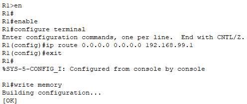

Tím R1 pošle jakýkoliv provoz, který nepatří do jeho interních sítí, na R2.

**Konfigurace na R2** – přidáme statické trasy do všech interních sítí kavárny:

```
enable
configure terminal
ip route 192.168.10.0 255.255.255.0 192.168.99.2  
ip route 192.168.20.0 255.255.255.0 192.168.99.2  
ip route 192.168.30.0 255.255.255.0 192.168.99.2  
ip route 192.168.40.0 255.255.255.0 192.168.99.2
exit
write memory
```
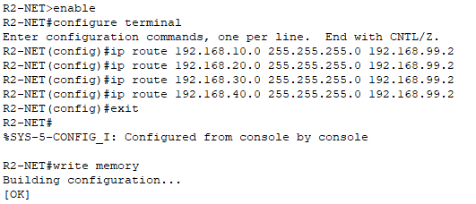

Po těchto krocích si oba routery navzájem „vidí“ do svých sítí a můžeme pokračovat nastavením NAT/PAT.

>**Poznámka:** Ve statických trasách zadáváme síťovou adresu s maskou, aby se směrování vztahovalo na celou podsíť, ne jen na jedno konkrétní zařízení.

### Ověření statického směrování mezi R1 a R2

Po nastavení statických tras ověříme, že si oba routery správně „vidí“ do svých sítí a provoz prochází obousměrně.

#### Kontrola směrovacích tabulek 

Na obou routerech zobrazíme aktuální směrovací tabulku přes příkaz:

```
show ip route
```

**Router R1:**

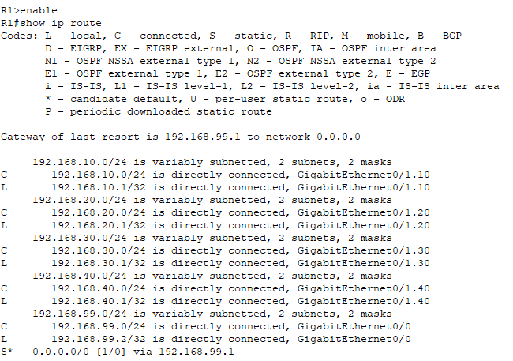

Tímto jsme potvrdili, že R1 má připojené všechny VLANy a aktivní výchozí trasu (default route) směrem na R2, která zajistí odchozí provoz z interních sítí.

**Router R2:**

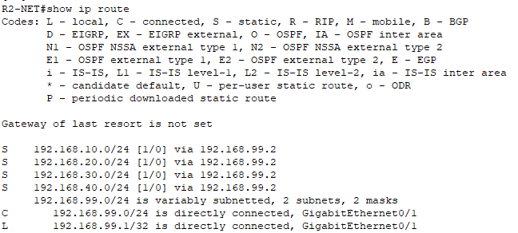

Tímto jsme ověřili, že R2 má nakonfigurované statické trasy do všech interních VLAN a že je směruje přes rozhraní 192.168.99.2 na R1.


### Testy konektivity pomocí ping

- Z **PC-2 (VLAN 10)** ověříme spojení na R2:  

Použijeme příkaz: `ping`

```
192.168.99.1
```
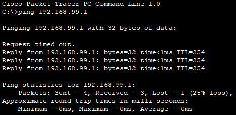
 
 - Z **R2** ověříme spojení na výchozí bránu **R1:**  
 
Použijeme příkaz:`ping`

```
ping 192.168.10.1  
ping 192.168.30.1  
ping 192.168.40.1
```
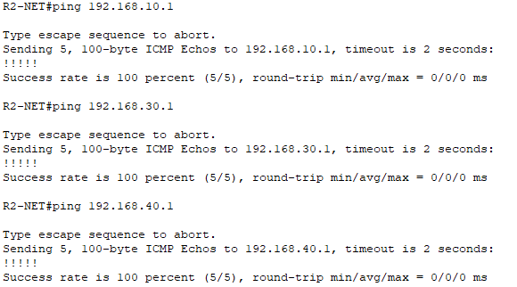


## 5.3 - Konfigurace NAT/PAT na R1

V této části provedeme nastavení překladu adres a portů na routeru R1, aby interní VLAN (10–40) mohly komunikovat s internetem přes router R2.  
Na rozhraní `GigabitEthernet0/0` (192.168.99.2) bude R1 překládat veškerý odchozí provoz z interních sítí na svou veřejnou IP adresu.


### Označení „inside“ a „outside“ rozhraní + uložení konfigurace

Tento krok určuje, které rozhraní je venkovní (směrem k internetu přes R2) a které vnitřní (směrem k interním VLAN). Konfigurace probíhá na **Routeru R1**.

- Rozhraní G0/0 nastavíme jako venkovní.
    
- Subrozhraní G0/1.10 až G0/1.40 nastavíme jako vnitřní.

**Příkazy na R1:**

```
enable  
configure terminal  
interface GigabitEthernet0/0  
ip nat outside  
exit  
interface GigabitEthernet0/1.10  
ip nat inside  
exit  
interface GigabitEthernet0/1.20  
ip nat inside  
exit  
interface GigabitEthernet0/1.30  
ip nat inside  
exit  
interface GigabitEthernet0/1.40  
ip nat inside  
exit  
end  
write memory
```
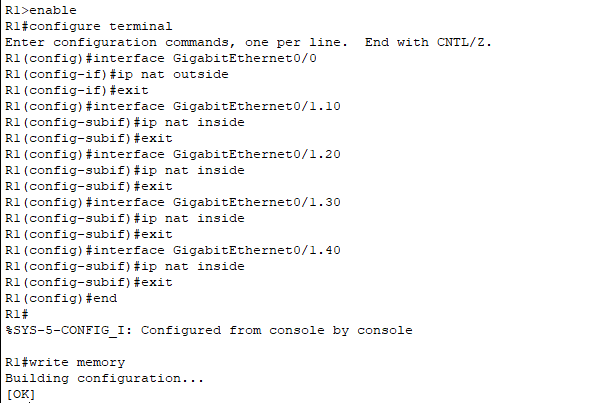

### ACL pro interní sítě (co se má překládat)

Aby NAT věděl, které adresy má překládat, vytvoříme ACL (Access Control List). V tomto případě povolíme všechny čtyři interní VLAN (10–40). Konfigurace probíhá na **Routeru R1**.

- Vytvoříme číselný ACL seznam č. 1.
    
- Přidáme jednotlivé podsítě interních VLAN.

**Příkazy na R1:** 

```
enable  
configure terminal  
access-list 1 permit 192.168.10.0 0.0.0.255  
access-list 1 permit 192.168.20.0 0.0.0.255  
access-list 1 permit 192.168.30.0 0.0.0.255  
access-list 1 permit 192.168.40.0 0.0.0.255  
end
write memory
```
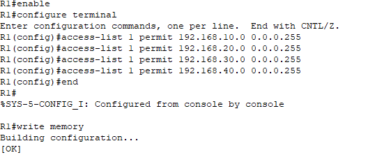

>**Poznámka:** V ACL se používají síťové adresy s maskou/wildcard, aby pravidlo pokrylo celou podsíť, ne jen konkrétní host. Toto konkrétní ACL slouží pouze pro NAT/PAT – router tak ví, které interní sítě má překládat na svou veřejnou adresu. Nejde o bezpečnostní opatření. 
>**Bezpečnostní ACL pro omezení komunikace mezi VLAN a přístupu na router bude řešeno zvlášť v kapitole _Zabezpečení sítě_.


### Nastavení NAT/PAT (overload)

Na základě vytvořeného ACL nastavíme pravidlo NAT/PAT, které zajistí, že všechny adresy povolené v ACL se přeloží na adresu rozhraní G0/0. Použijeme přetížení (overload), aby mohla jednu veřejnou IP adresu využívat více zařízení současně. Konfigurace probíhá na Routeru R1.

- Aktivujeme NAT/PAT pro ACL č. 1 na rozhraní G0/0 s přepínačem `overload`.

**Příkazy na R1:** 

```
enable  
configure terminal  
ip nat inside source list 1 interface GigabitEthernet0/0 overload  
end
write memory
```
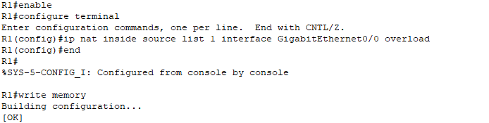
Tím je NAT/PAT nastaven a připraven k použití.

>**Poznámka:** NAT/PAT se nastavuje jen na rozhraní, které vede směrem do internetu (_outside_). V našem případě je to G0/0, protože je připojené k hraničnímu routeru R2, za kterým se nachází server simulující funkce internetu. Rozhraní G0/1 je naopak uvnitř naší sítě (_inside_) a NAT se na něj nepoužívá.  
  V příkazu `ip nat inside source` slovo _inside_ neznamená, že NAT běží na rozhraní G0/1 – říká jen, že se překládají **zdrojové adresy z vnitřní sítě** na veřejnou adresu _outside_ rozhraní. To, které rozhraní je _inside_ a které _outside_, určujeme zvlášť příkazy `ip nat inside` a `ip nat outside` přímo na konkrétních portech.


### Diagnostika NAT/PAT

Po konfiguraci ověříme, že NAT/PAT funguje správně.

**Příkazem na R1:**  

```
enable  
show ip nat statistics
```
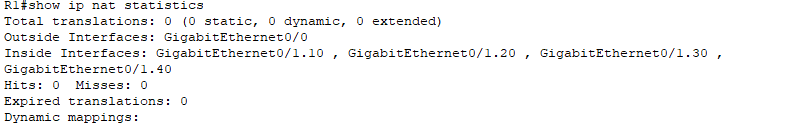

**Vysvětlení výpisu:**

- **Outside Interface** je správně nastaven na `GigabitEthernet0/0`, což je port směrem k internetu.
    
- **Inside Interfaces** zahrnují subrozhraní `GigabitEthernet0/1.10`, `.20`, `.30` a `.40`, což odpovídá VLAN 10–40.  
     **To potvrzuje, že NAT je správně nakonfigurovaný pro všechny VLANy.**
    
- V našem případě jsou hodnoty **0**, protože ještě neproběhl žádný provoz směrem ven z vnitřní sítě.

>**Poznámka:** `show ip nat translations` zobrazí **konkrétní aktivní překlady** (např. původní a přeložené IP/porty). Pokud tabulka zůstává prázdná, znamená to, že zatím žádný provoz neprošel přes NAT, nebo že překlady již expirovaly.


**Test pingů pro ověření konektivity:**  

Abychom potvrdili, že NAT/PAT neblokuje ICMP provoz (pingy), otestujeme spojení v obou směrech.

- **Z PC-2 ve VLAN** provedeme příkaz ping na Router R2:  

```
ping 192.168.99.1
```
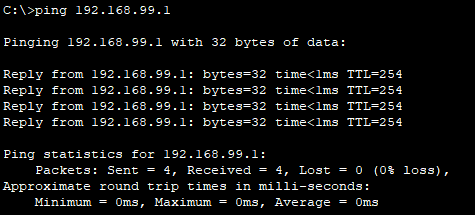

- **Z routeru R2** provedeme ping na výchozí brány **R1:** 

```
ping 192.168.10.1  
ping 192.168.20.1  
ping 192.168.30.1  
ping 192.168.40.1
```
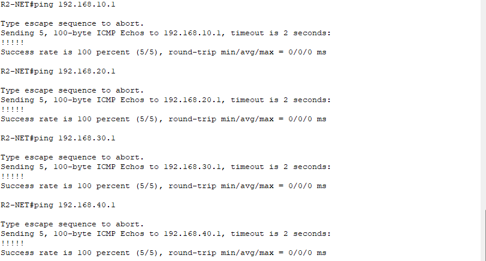


**Všechny testovací pingy byly úspěšné**, což potvrzuje správnou funkci NAT/PAT a konektivitu mezi vnitřní sítí a simulovaným internetem.


## 5.4 - Shrnutí 

V této části jsme na Routeru R1 nastavili překlad adres NAT a jeho rozšíření PAT, díky kterému mohou všechna zařízení v naší vnitřní síti využívat jedinou veřejnou IP adresu pro přístup k internetu. Určili jsme rozhraní směrem do internetu (outside) a do vnitřní sítě (inside), nakonfigurovali přístupovou listinu pro překlad a ověřili funkčnost pomocí oboustranných pingů. Díky tomu jsme potvrdili, že NAT/PAT neblokuje běžnou komunikaci, a připravili jsme síť na propojení s dalšími službami v následující kapitole 6 (DNS a WIFI).

Pokračovat na další kapitolu: [Internet a DNS](06-internet-a-dns.md)


