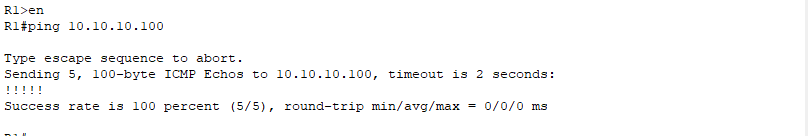

# **6 - Internet a DNS**

## 6.1 - Úvod

Tady propojíme naši síť se simulovaným internetem, který zastupuje server umístěný za hraničním routerem R2. Tento server bude zajišťovat překlad domén (DNS) a jednoduchou HTTP službu pro ověření funkčnosti.

Nejprve nakonfigurujeme rozhraní **G0/0** na R2 směrem k serveru a na serveru ručně nastavíme IP adresu, masku a bránu. Poté na serveru vytvoříme DNS záznamy, spustíme HTTP službu a otestujeme přístup z PC ve VLAN pomocí doménového jména i webové stránky.

Nakonec ověříme, že požadavky z VLAN prochází přes NAT/PAT na R1 a jsou správně překládány serverem.

## 6.2 - Nastavení IP adresy na serveru

V tomto kroku nastavujeme na Internet-Serveru pevnou IP adresu, aby mohl komunikovat s hraničním routerem R2 a poskytovat služby pro naši síť.

Na serveru otevíráme **Desktop -> IP Configuration** a přepínáme režim na **Static**. Do příslušných polí zadáváme:

- IPv4 Address: `10.10.10.100`
    
- Subnet Mask: `255.255.255.0`
    
- Default Gateway: `10.10.10.1`
    
- DNS Server:  `0.0.0.0 `


Server tak získává pevnou adresu v síti mezi ním a routerem R2, což mu umožňuje plnit roli poskytovatele služeb, jako je DNS nebo HTTP.

>**Poznámka:** DNS server necháváme na 0.0.0.0, protože tento server sám plní roli DNS pro celou síť a nepotřebuje přeposílat dotazy jinam.


## 6.3 - Nastavení IP adresy na portu G0/0 routeru R2

Na routeru R2 je potřeba nakonfigurovat rozhraní **GigabitEthernet0/0**, aby se nacházelo ve stejné síti jako Internet-Server a mohlo směrovat provoz mezi serverem a zbytkem sítě.

Pro port **G0/0** zadáme následující příkazy:

```
enable
configure terminal
interface GigabitEthernet0/0
ip address 10.10.10.1 255.255.255.0
no shutdown
exit
end
write memory
```


>**Poznámka:** Jako výchozí bránu zadáváme adresu routeru R2, protože ten zajišťuje směrování provozu mimo tuto podsíť.

Po aplikaci nastavení je rozhraní aktivní a připravené pro komunikaci se serverem.  
Server a router jsou nyní ve stejné podsíti, což umožňuje přímé spojení a přístup k poskytovaným službám jako DNS a HTTP.

### Diagnostika připojení k serveru

- Z **PC3** provedeme příkaz: na adresu Internet-Serveru:

```
ping 10.10.10.100
```


- Z **Routeru R1** také provedeme stejný příkaz:

```
ping 10.10.10.100
```


Ping je v obou případech úspěšný, což potvrzuje správné propojení klienta i routeru s Internet-Serverem a funkční komunikaci v síti.


## 6.4 - Konfigurace DNS a HTTP služeb na serveru

Na serveru zapínáme služby DNS a HTTP, aby mohl poskytovat překlad doménových jmen a zároveň sloužit jako jednoduchý webový server pro testování.

DNS (Domain Name System) je služba, která překládá doménová jména (např. google.com) na odpovídající IP adresy;

### DNS Service

- Přejdeme na **Services → DNS**
    
- Zapneme službu **DNS (On)**
    
- Přidáme nový záznam:
    
    - **Name:** google.com _(příklad)_
        
    - **Address:** _např. 10.10.10.100_ (IP adresa našeho lokálního web serveru)
        
- Uložíme záznam.


 >**Poznámka:** DNS záznam slouží k přiřazení IP adresy k doménovému jménu. HTTP služba pak umožní zobrazit webovou stránku přímo z tohoto serveru.
   V Packet Traceru je vhodné používat adresu zařízení, které v simulaci skutečně existuje a poskytuje danou službu. Reálné veřejné adresy (např. 8.8.8.8) zde nebudou fungovat, protože síť není připojena k internetu – veškerý provoz zůstává v rámci simulace.


### HTTP Service

Zde nastavujeme HTTP (Hypertext Transfer Protocol). HTTP je síťový protokol sloužící k přenosu webových stránek a dalších dat mezi webovým serverem a klientem (např. webovým prohlížečem).

- Přejdeme na **Services → HTTP**
    
- Zapneme službu **HTTP (On)**


## 6.5 – Testování z klientských PC

Ted se zaměříme na testování funkčnosti celé konfigurace sítě.  
Cílem je ověřit, že jednotlivé služby (DNS, HTTP) a připojení k internetu v simulovaném prostředí fungují podle očekávání.

Je nutné Na PC-2 nastavit v konfiguraci síťového adaptéru jako DNS server adresu **10.10.10.100**, aby překlad domén probíhal přes náš lokální server.“

- Na PC ve VLAN20 otevřeme **Command Prompt** a zadáme:  

```
ping google.com    
```


- Otevřeme webový prohlížeč a zadáme: 

```
google.com
```


Ping byl v **Command Prompt** úspěšný a ověření v prohlížeči na PC-2 potvrdilo, že překlad doménového jména přes náš DNS server funguje – zadání `google.com` načetlo testovací stránku z HTTP služby serveru.


## 6.6 - Diagnostika NAT/PAT

Po úspěšném zprovoznění DNS služby a načtení simulovaného webu google.com tak provádíme nutnou diagnostiku funkce PAT/NAT.  
Ověříme, zda překlad soukromých IP adres na veřejnou probíhá správně a zda je zajištěna konektivita mezi interní sítí a simulovaným internetem.


Na R1 ověřte překlad adres pomocí příkazu:

```
enable  
show ip nat translations
```


Výpis `show ip nat translations` potvrzuje funkční NAT/PAT z PC-20 (192.168.20.10) A úspěšně se překládají na Inside global a komunikují s cílovými adresami (např. 10.10.10.100). DNS i HTTP služby na serveru jsou plně funkční a ověřeny testem v síti.


## 6.7 - Shrnutí

V této kapitole jsme úspěšně propojili naši interní síť se simulovaným internetem prostřednictvím routeru R2. Na R2 jsme nakonfigurovali port směrem k serveru, který je umístěn v oddělené síti, a zajistili jeho dostupnost pro klienty. 
Na serveru jsme nastavili a spustili DNS službu pro překlad doménových jmen a HTTP službu pro webový přístup. 

Ověřili jsme, že z klientských PC je možné úspěšně pingnout server pomocí jeho IP adresy i názvu a zároveň načíst webovou stránku z HTTP serveru. Diagnostika potvrdila funkčnost obou služeb a připravenost sítě pro další krok, kterým bude kapitola věnovaná zabezpečení sítě a nastavení ochranných prvků proti neautorizovanému přístupu.

Pokračovat na další kapitolu: [Zabezpečení sítě](07‑zabezpeceni‑site.md)


