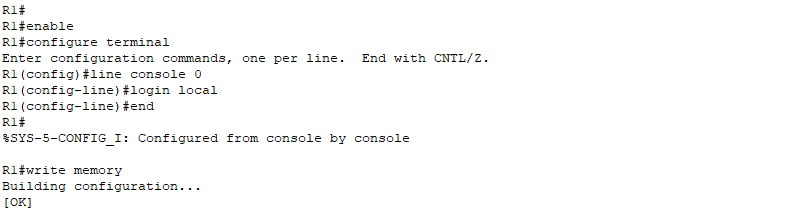

# **7 – Zabezpečení sítě**


## 7.1 – Úvod


Bezpečnost je klíčová pro každou síť. I dobře navržená topologie je zranitelná, pokud není chráněna proti neoprávněnému přístupu a zneužití. V této kapitole ukážeme, jak z modelové sítě kavárny udělat spolehlivé a bezpečné prostředí.

Projdeme základní kroky, jako je nastavení uživatelských účtů a hesel, varovných bannerů při přihlášení, omezení připojení pomocí **Port Security** a vypnutí nevyužitých portů. Na závěr se zaměříme na **Access Control Listy (ACL)**, které určují, kdo může v síti komunikovat.

Cílem je vytvořit síť, která je funkční a zároveň odolná proti běžným hrozbám v lokálním prostředí.

## 7.2 – Přihlášení pomocí uživatelského jména a hesla + heslo pro privilegovaný režim

Aby se do zařízení dostali jen oprávnění uživatelé, nastavíme lokální účet s uživatelským jménem a heslem **(username + password)** a současně heslo pro privilegovaný režim **(enable secret)**.  

Po přihlášení bude zařízení vyžadovat nejdříve uživatelské jméno a heslo a poté při přechodu do privilegovaného režimu heslo `enable secret`.  

Pro první projekt použijeme variantu **password** + `service password-encryption`, abychom viděli, jak se heslo v konfiguraci skryje.  
U dalšího projektu už nasadíme rovnou **secret**, které je šifrované automaticky.  
Nastavíme to na routerech **R1**, **R2** a na switchi.

Příkaz provedeme následovně:

```
enable
configure terminal
username cafeadmin password latte4269   
enable secret Arabickashot25
exit
write memory
```


Když se nyní podíváme na konfiguraci (`show running-config`)například u Router R1, heslo u `username` je viditelné v čitelné podobě.


Pro jeho skrytí použijeme příkaz:
```
enable
configure terminal
service password-encryption
end
write memory
```


**Po opětovném zobrazení konfigurace budou hesla zakódovaná.**


## 7.3 – Zabezpečení konzolového přístupu (login local)

Aby se zařízení při připojení přes konzoli ptalo na uživatelské jméno a heslo, povolíme lokální přihlášení:

```
enable
configure terminal
line console 0
login local
end 
write memory
```


Tím zajistíme, že uživatel musí zadat přihlašovací údaje hned při vstupu do zařízení přes konzoli.

### Ověření přihlášení a hesla

1. Odhlásíme se ze zařízení (`logout`).
    
2. Přihlásíme se znovu – zobrazí se:


Username:
Password:

Po zadání správných údajů se dostaneme do uživatelského režimu **(>)**.

Příkazem **enable** přejdeme do privilegovaného režimu **(#)** po zadání enable secret hesla.

Ověříme příkazem, že hesla jsou zašifrovaná příkazem:

```
show running-config
```


>**Poznámka:** Pro účely dokumentace byla konfigurace a diagnostika provedena pouze na routeru **R1** jako reprezentativní příklad, aby se předešlo zbytečnému opakování totožných kroků na dalších zařízeních. Stejný postup bude i u dalších typu zabezpečení.


## 7.4 – Varovné bannery při přihlášení (MOTD + Login banner)

Varovné bannery informují každého, kdo se k zařízení připojuje, že přístup je omezený.  
Zobrazují se **před** přihlášením a slouží jako důležité bezpečnostní i právní opatření.

**Nastavíme dva typy bannerů:**

- **MOTD banner**: obecné varování zobrazené před přihlašovací výzvou.
     
- **Login banner** – konkrétní varování, které se zobrazí přímo před zadáním uživatelského jména a hesla.

**Při nastavování banneru je nutné zvolit oddělovač (např. `#`) a tento znak zadat jak před samotný text banneru, tak i za něj, aby router věděl, kde text začíná a končí.**

Příklady co použijeme pro nastavení:

```
enable
configure terminal
banner motd #Unauthorized access is prohibited#
banner login #Restricted area – authorized personnel only#
end
write memory
```


Tyto bannery nastavíme na routerech **R1**, **R2** a na switchi.

>**Poznámka:** Login banner se zobrazí i při Telnet/SSH připojení přes konzoli k danému zařízení.
### Ověření banner motd

Po odhlášení z relace a opětovném přihlášení se před výzvou k zadání uživatelského jména zobrazí jak MOTD banner, tak login banner, čímž se potvrzuje jejich správná konfigurace.


>**Poznámka:** Na switche v Packet Traceru (např. Cisco 2960) nelze použít `banner login`, podporován je pouze `banner motd`. Pokud chceme zobrazit více upozornění, je nutné je sloučit do jednoho MOTD banneru a oddělit je novým řádkem.

## 7.5 – Zabezpečení Telnet přístupu (VTY lines)

Telnet je síťový protokol, který umožňuje vzdálený přístup k síťovým zařízením prostřednictvím příkazového řádku. Pokud není chráněn, může kdokoliv v síti získat přístup do routeru nebo switche.  
Nastavením hesla (a volitelně uživatelského jména) na tzv. **VTY lines** (virtuálních terminálových linkách) zajistíme, že přístup přes Telnet bude povolen pouze autorizovaným uživatelům.  
Po nastavení této konfigurace bude **každý PC v síti**, který se pokusí připojit k síťovému zařízení pomocí Telnetu, vyzván k zadání přihlašovacích údajů.  
Tím je síť chráněna proti neautorizovanému přístupu z jiných PC do síťových zařízení.

### Konfigurace Telnet zabezpečení

**Postup na každém síťovém zařízení (R1, R2, SW1):**

- Připojíme se k zařízení přes **CLI Console** v Packet Traceru.  
- Nastavíme uživatelské jméno a heslo pro Telnet.  
- Přejdeme na konfiguraci VTY linek (0 až 4 pro současně max. 5 Telnet spojení).  
- Povolíme ověřování podle uživatelských účtů.  
- Povolíme Telnet protokol (v Packet Traceru je obvykle povolen, ale explicitně jej nastavíme).  

```
enable
configure terminal
username cafeadmin password Espresso25
line vty 0 4
login local
transport input telnet
end
write memory
```

>**Poznámka:**  Při nastavování Telnetu jsme znovu zadali heslo pro _cafeadmin_, čímž se původní heslo nahradilo novým (_Espresso25_). Stalo se to proto, že příkaz `username` vždy při opětovném použití heslo přepíše.

### Ověření nastavení

* Na libovolném PC v síti otevřeme **Command Prompt** (Desktop → Command Prompt).
    
* Zadáme příkaz pro připojení na zařízení, např.:
    
    - `telnet 192.168.10.1` _(IP adresa R1)_
        
*  Zobrazí se výzva:

User Access Verification
Username:
Password:


- Po zadání správného uživatelského jména a hesla získáme přístup k CLI zařízení.
    
- Po zadání špatných údajů by bylo logicky připojení odmítnuto.
- **v Command Prompt** vidíme i aktivní bannery z konfigurace u předchozí kapitoly.

>**Poznámka:** Výše všechny použitá hesla jsou inspirována tématem naší modelové kavárny a slouží pouze pro ukázku v rámci projektu, proto nejsou názorně tak silná jako v reálné praxi.


## 7.6 – Port Security na aktivních portech

**Cílem téhle funkce je chránit všechny používané porty (zaměstnanecký i zákaznické) proti neautorizované výměně zařízení**.

Port Security je funkce na switchích, která omezuje, kolik a jakých MAC adres může být na konkrétním portu povoleno. Pokud někdo odpojí zařízení a připojí jiné, port buď zablokuje provoz, nebo spustí konfigurovanou akci (např. „shutdown“). 
Tím chráníme síť proti neautorizovaným zařízení. 


**Postup:**

1. Zvolíme v konfiguračním režimu vybraný port.
    
2. Nastavíme Port Security a povolíme pouze jednu MAC adresu na portu.
    
3. Nastavíme akci při porušení – „shutdown“.
    
4. Pak uložíme konfiguraci.


**Konfiguraci provedeme následovně:**

- **PC-1** – VLAN 10 (Fa0/1)  

```interface Fa0/1  
enable
configure terminal
interface Fa0/1  
switchport mode access  
switchport access vlan 10  
switchport port-security  
switchport port-security maximum 1  
switchport port-security violation shutdown  
switchport port-security mac-address sticky
exit
```

- **PC-2** – VLAN 20 (Fa0/2)  


```
interface Fa0/2  
switchport mode access  
switchport access vlan 20  
switchport port-security  
switchport port-security maximum 1  
switchport port-security violation shutdown  
switchport port-security mac-address sticky
exit
```

* **PC-3** – VLAN 30 (Fa0/3)  

```
interface Fa0/3  
switchport mode access  
switchport access vlan 30  
switchport port-security  
switchport port-security maximum 1  
switchport port-security violation shutdown  
switchport port-security mac-address sticky
exit
```

* **PC-4** – VLAN 40 (Fa0/4)  

```
interface Fa0/4  
switchport mode access  
switchport access vlan 40  
switchport port-security  
switchport port-security maximum 1  
switchport port-security violation shutdown  
switchport port-security mac-address sticky
exit
write memory
```


**Stručné vysvětlení ke konfiguraci:**

- **MAC adresa** – unikátní identifikátor síťové karty, podle kterého switch pozná, zda je připojeno autorizované zařízení.
    
- **Maximální počet MAC** – určuje, kolik různých zařízení může být na portu povoleno.
    
- **Violation mode** – akce při porušení (např. port se vypne, ale může být nastaven i režim jen logování).


## 7.7 – Administrativní vypnutí nepoužívaných portů

**Cíl:** Zabránit neautorizovanému připojení přes nepoužívané porty switche.

**Úvod:**  
Neaktivní porty na switchi jsou běžně bezpečnostní slabinou – kdokoliv by mohl připojit vlastní zařízení a získat přístup do sítě. Proto je běžnou praxí všechny nepoužívané porty **administrativně vypnout**. V naší topologii to znamená porty **Fa0/5–Fa0/24** a **Gi0/2**.

**Postup**  
Vypneme všechny porty, které nejsou součástí aktivní topologie.  
V našem případě jde o všechny porty od `FastEthernet0/5` do `FastEthernet0/24` a port `GigabitEthernet0/2`.  

Pro každý port použijeme příkazy:

```
interface (rozsah_portů)
shutdown
```

nebo

```
interface range fa0/5 - 24 , gi0/2
shutdown
```


**Vysvětlení**  
Tímto krokem zabráníme připojení neautorizovaných zařízení na nevyužité porty.  
Pokud by někdo fyzicky zapojil kabel do některého z vypnutých portů, **spojení nebude navázáno**.


### Ověření funkčnosti:

Pro ověření funkčnosti můžeme použít příkazy dva příkazy, které zobrazí jak nastavení port security, tak i administrativně vypnuté porty.

```
show ip interface brief
```


```
Show running-config
```


Výpis potvrzuje, že port security je aktivní na požadovaných portech a nepoužívané porty jsou úspěšně administrativně vypnuté.

## 7.8 – Access Control List (ACL)

V této části se zaměřujeme na **řízení přístupu** mezi VLANami a zařízeními v síti pomocí **Access Control Listů (ACL)**.  
ACL nám umožňují **povolit** nebo **zakázat** určité typy provozu na základě IP adres, protokolů a portů.  
Naším cílem je vytvořit pravidla tak, aby:

- **PC-1 (VLAN 10)** mělo přístup ke všem ostatním VLANám i k serveru.
    
- Ostatní VLANy (20, 30, 40) měly přístup pouze k serveru (pro DNS a HTTP) a nebylo možné, aby mezi sebou komunikovaly.
    
- Byl zachován přístup z Routeru R1 a R2 k potřebné diagnostice (ping) a správě.
    

Tento přístup zajišťuje rozdělení a fungování sítě** podle našich nastavených pravidel a zároveň chrání jednotlivé VLANy před neautorizovaným přístupem.


### Konfigurace ACL

Konfiguraci jsme aplikovali **na subrozhraní routeru R1** směrem do jednotlivých VLAN (`inbound`), aby se provoz filtroval ještě před vstupem do cílových VLAN.

#### ACL Konfigurace pro VLAN 20

```
enable
configure terminal
ip access-list extended V20
permit icmp 192.168.20.0 0.0.0.255 host 192.168.10.10 echo-reply
permit icmp 192.168.20.0 0.0.0.255 host 192.168.20.1 echo-reply
permit ip 192.168.20.0 0.0.0.255 host 10.10.10.100
deny ip 192.168.20.0 0.0.0.255 host 192.168.10.10
deny ip 192.168.20.0 0.0.0.255 host 192.168.99.2
deny ip 192.168.20.0 0.0.0.255 host 192.168.99.1
deny ip 192.168.20.0 0.0.0.255 192.168.30.0 0.0.0.255
deny ip 192.168.20.0 0.0.0.255 192.168.40.0 0.0.0.255
deny ip 192.168.20.0 0.0.0.255 any
exit
interface g0/1.20
ip access-group V20 in
exit
end
write memory
```


#### ACL Konfigurace pro VLAN 30

```
ip access-list extended V30
permit icmp 192.168.30.0 0.0.0.255 host 192.168.10.10 echo-reply
permit icmp 192.168.30.0 0.0.0.255 host 192.168.30.1 echo-reply
permit ip 192.168.30.0 0.0.0.255 host 10.10.10.100
deny ip 192.168.30.0 0.0.0.255 host 192.168.10.10
deny ip 192.168.30.0 0.0.0.255 host 192.168.99.2
deny ip 192.168.30.0 0.0.0.255 host 192.168.99.1
deny ip 192.168.30.0 0.0.0.255 192.168.20.0 0.0.0.255
deny ip 192.168.30.0 0.0.0.255 192.168.40.0 0.0.0.255
deny ip 192.168.30.0 0.0.0.255 any
exit
interface g0/1.30
ip access-group V30 in
exit
end
write memory
```


#### ACL Konfigurace pro VLAN 40

```
ip access-list extended V40
 permit icmp 192.168.40.0 0.0.0.255 host 192.168.10.10 echo-reply
 permit icmp 192.168.40.0 0.0.0.255 host 192.168.40.1 echo-reply
 permit ip 192.168.40.0 0.0.0.255 host 10.10.10.100
 deny ip 192.168.40.0 0.0.0.255 host 192.168.10.10
 deny ip 192.168.40.0 0.0.0.255 host 192.168.99.2
 deny ip 192.168.40.0 0.0.0.255 host 192.168.99.1
 deny ip 192.168.40.0 0.0.0.255 192.168.20.0 0.0.0.255
 deny ip 192.168.40.0 0.0.0.255 192.168.30.0 0.0.0.255
 deny ip 192.168.40.0 0.0.0.255 any
exit
interface g0/1.40
 ip access-group V40 in
exit
write memory
```


### Vysvětlení konfigurace:

- `permit icmp ... echo-reply` – povoluje odpověď na ping z PC-1 a z R1, aby byla možná diagnostika.
    
- `permit ip ... server` – umožňuje přístup k serveru (DNS a HTTP).
    
- `deny ip ... host PC-1` – blokuje neautorizovaný přístup z VLAN 20 směrem na PC-1 (mimo povolený ping).
    
- `deny ip ... host R1/R2` – zamezuje přímému přístupu na routery.
    
- `deny ip ... VLAN 30/40` – izoluje VLANy mezi sebou.
    
- `deny ip ... any` – implicitně zakazuje vše ostatní.
    

Stejný princip jsme použili i pro VLAN 30 a 40, pouze s úpravou adres.


### Závěr

Nasazením ACL jsme dosáhli toho, že:

- **PC-1** má plný přístup k ostatním VLANám.
    
- VLANy 20, 30 a 40 mají přístup jen k serveru a na diagnostické pingy, ale ne mezi sebou.
    
- Přístup k routerům R1 a R2 je z VLAN omezen, čímž se zvyšuje bezpečnost.
    
- DNS a HTTP komunikace funguje napříč VLANami, takže uživatelé mají přístup k simulovanému internetu.
    

Tento způsob nastavení ACL je **přehledný, opakovatelný** v rámci výuky v CCNA I.


### Diagnostika ACL

Po nasazení ACL jsme ověřili, že pravidla fungují podle očekávání. Testy byly provedeny z různých VLAN směrem na ostatní VLANy, routery a server.

**Postup testování:**

1. **Ping z PC-1 (VLAN 10)**

- Ověřen přístup na všechna zařízení ve VLAN 20, 30 a 40 → **OK**

- Ověřen přístup na server `10.10.10.100` → **OK**


>**Poznámka:** Směr pingů je povolen pouze z PC-1 směrem do vnitřních VLAN (20, 30, 40). Opačný směr z těchto VLAN na PC-1 -> je zablokován záměrně pro zvýšení bezpečnosti. Toto nastavení chrání PC-1 (např. administrátorský počítač) před neautorizovaným přístupem z ostatních segmentů, ale zároveň umožňuje ověřit konektivitu a funkčnost ACL z hlavního PC.


2. **Ping z PC-2 (VLAN 20)**
    
    - Ping na PC-1 -> **NEPROŠEL**  (blokování z hlediska zabezpečení ACL)
        
    - Ping na PC-3 a PC-4 (VLAN 30 a 40) -> **NEPROŠLO** (blokováno ACL)
        
    - Ping na server `10.10.10.100` -> **OK** (Nutné pro přístup ke službám DNS/HTTP)
        
    - Ping na R1 (192.168.99.2) -> NEPROŠLO (Zakázno pro lepší zabezpečení sítě)
        
    - Ping na R2 (192.168.99.1) -> **NEPROŠLO** (blokováno ACL)
 


>**Poznámka:** Stejné výsledky byly zaznamenány i při testování z PC-3 (VLAN 30) a PC-4 (VLAN 40), protože ACL pro tyto VLANy má shodnou logiku a pořadí pravidel jako u VLAN 20


3. **Ping z Routeru R1**
    
    - Přístup na všechny brány VLAN → **OK** (ACL neblokuje pingy odesílané z  R1 do VLAN a odpovědi jsou přijímány).
    
     * Ping na server `10.10.10.100` -> **OK**
    
     * Ping na hraniční Router R2 -> **OK**


**ACL tak splnilo svůj účel – nastavilo přesné hranice přístupů mezi VLANami a zajistilo, že síť zůstane přehledná a bezpečná.**


## 7.9 – Shrnutí 

V této kapitole jsme síť postupně zabezpečili – od **bannerů a hesel** (enable secret,telnet), přes **Port Security** a **vypnutí nepoužívaných portů**, až po **ACL** pro omezení komunikace mezi VLANami a povolení jak klíčových zařízení sítě (Routery, PC-1) tak i potřebných služeb, jako DNS a HTTP. 

Výsledkem je **izolovaná, ale plně funkční síť**, chráněná přesnými **bezpečnostními pravidly**, která minimalizují riziko neoprávněného přístupu a zajišťují spolehlivý a kontrolovaný provoz celé síťové infrastruktury kavárny.


