# 8 – Testování konektivity


## 8.1 – Úvod

V této kapitole provedeme cílenou diagnostiku, která potvrdí funkčnost celé sítě po konfiguraci všech prvků z kapitol 1–7.  

Cílem je stručně a přehledně ověřit, že všechny hlavní komponenty sítě spolupracují podle návrhu.


>**Poznámka:** Testujeme pouze zásadní prvky konektivity, protože kompletní testy jednotlivých částí byly prováděny průběžně v předchozích kapitolách.  

---

## 8.2 - Ověření základní konektivity mezi R1 a R2

**Účel testu:** Ověřit, že fyzické propojení mezi centrálním routerem R1 a hraničním routerem R2 je funkční a umožňuje obousměrnou komunikaci.

**Použitý příkaz:**  

```
ping 192.168.99.1
```

**Ověření:** Ping z R1 na R2-NET


**Závěr:** Propojení mezi R1 a R2 je plně funkční, Odpověd k pingu potvrzuje konektivitu.


## 8.3 - Ověření směrování a funkčnosti VLAN

**Účel testu:** Ověřit, že VLAN komunikace probíhá dle návrhu – mezi VLAN je směrování aktivní a konfigurace na switchi odpovídá plánovanému stavu.

**Použité příkazy:**  

- `ping 192.168.30.10` ping z PC-1 do PC-3

- `show vlan brief` (na SW1 – kontrola přiřazení portů a názvů VLAN)

**Ověření:** Ping z PC-1 do jiné VLAN, výpis VLAN ze SW1 s potvrzením správných názvů a aktivních portů.

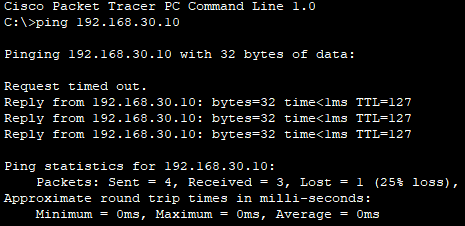
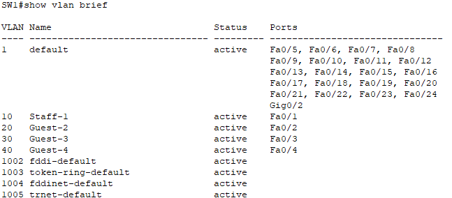

### Závěr

Ping z PC-1 do PC-3 prošel. VLANY jsou správně vytvořené, porty jsou přiřazené dle návrhu a směrování mezi VLAN funguje.


## 8.4 - Ověření NAT/PAT a přístupu k serveru

**Účel testu:** Potvrdit, že NAT/PAT na R1 překládá adresy a umožňuje přístup k serveru.

**Použité příkazy:**  

- `ping 10.10.10.100` z R1 na server a z PC-2 také na server

- `show ip nat translations` (na R1 – ověření aktivních překladů)

**Ověření:**  Ping na server z vybraného R1 a PC-2, výpis NAT tabulky z R1 ukazující překlad interních IP na veřejnou.

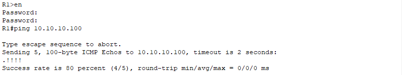

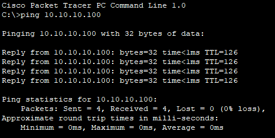

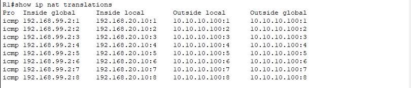

### Závěr

NAT/PAT funguje podle očekávání a umožňuje přístup z interních VLAN k serveru.


## 8.5 - Ověření DNS a HTTP služby

**Účel testu:** Ověřit, že DNS překlad a HTTP služba na serveru jsou dostupné a funkční.

**Použité příkazy:**  

- `ping google.com` z PC-4 – ověření DNS překladu  

- Otevření webového prohlížeče a zadání `google.com` (zobrazení testovací stránky z HTTP služby)

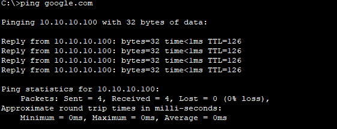
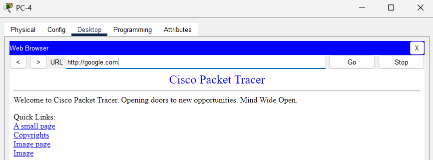

### Závěr

DNS i HTTP služby jsou funkční, doménová jména se překládají a webový obsah je dostupný.


## 8.6 - Ověření bezpečnostních pravidel (Port Security, ACL)

**Účel testu:** Potvrdit, že bezpečnostní opatření fungují – blokují nepovolený provoz a povolují schválenou komunikaci.

**K ověření použíjeme následující příklady níže:**

- `ping <IP>` z R1 na všechny VLAN a na server


* `ping <IP>` z PC-2 na všechny ostatní VLAN (ověření blokace mezi zákaznickými VLANy)


* `ping <IP>` z PC-1 na všechny ostatní VLAN (ověření úspěšné konektivity) a také ping na R1, R2 a server. Tím se potvrzuje, že PC-1 má plný přístup do celé sítě jako hlavní pracovní stanice zaměstnanců kavárny.

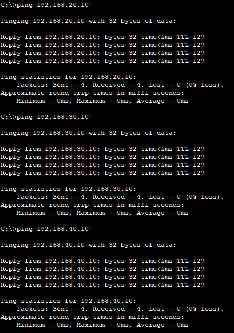
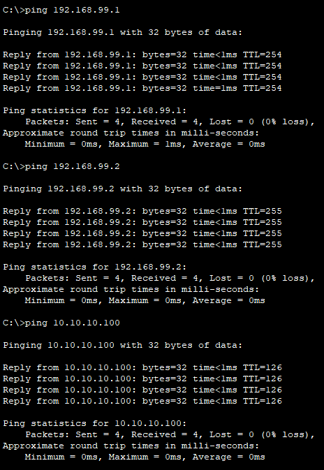

- `show port-security` (SW1 – stav port security)  

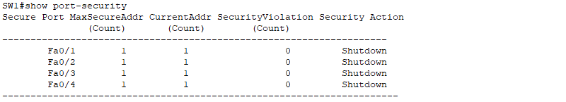

- `show ip interface brief` (SW1 – ověření administrativně vypnutých portů)

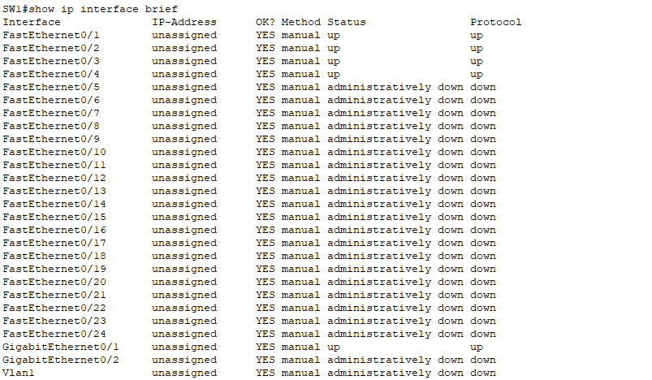

### Závěr 

Testy potvrdily, že nastavená bezpečnostní pravidla (Port Security a ACL) fungují správně – neautorizované komunikace mezi zákaznickými VLANy jsou blokovány, zatímco schválené přístupy k VLANám, ke klíčovým routerům a serveru jsou povoleny. Port Security aktivně chrání síť před nepovoleným připojením zařízení a vypnuté nepoužívané porty minimalizují riziko neoprávněného přístupu.


---

## 8.7 – Shrnutí

V této kapitole jsme provedli cílené ověření funkčnosti celé sítě po dokončení konfigurace z předchozích kapitol. Testování se zaměřilo na klíčové prvky propojení routerů, směrování mezi VLAN, funkčnost NAT/PAT, dostupnost DNS a HTTP služeb a ověření bezpečnostních opatření (Port Security, ACL). 

Kompletní testy jednotlivých částí sítě již proběhly průběžně v předchozích kapitolách, zde jsme tedy ověřovali pouze nejdůležitější scénáře. Výsledky potvrdily, že síť funguje podle návrhu a všechny testované služby jsou správně dostupné nebo blokované z hlediska cílů zabezpečení.

Směrování a překlad adres probíhají také správně a bezpečnostní pravidla účinně chrání síť před neautorizovaným přístupem.

Pokračovat na další kapitolu: [Řešení problémů](09‑reseni-problemu.md)
