# 9 – Troubleshooting


## 9.1 – Úvod

I při pečlivé konfiguraci se může do nastavení vloudit malá, ale zásadní chyba, která naruší provoz celé sítě. Stačí přepsání čísla nebo nechtěné zadání jiné hodnoty a síť přestane fungovat podle očekávání. V takové chvíli je nutné rychle rozpoznat příznaky problému, určit jeho příčinu a obnovit funkčnost.

Tato kapitola obsahuje **tři scénáře** vycházející z reálné konfigurace tohoto projektu. U každého popisujeme samotný problém, postup diagnostiky, opravu a finální ověření. Cílem je nejen ukázat řešení, ale i myšlenkový proces, který k němu vede, tedy jak v praxi probíhá troubleshooting při správě sítě.

>**Poznámka„:** V rámci projektu jsme záměrně vytvořili několik chybových scénářů pro simulaci běžných problémů v síťovém provozu. Cílem bylo si procvičit diagnostiku a opravu konfigurace.“


## 9.2 –  Chybná konfigurace VLAN ID na subinterface

Při konfiguraci routeru R1 byla na jedné z podrozhraní (`GigabitEthernet0/1.20`) omylem nastavena nesprávná hodnota **VLAN ID**. Místo správného `dot1Q 20` bylo zadáno `dot1Q 200`. Taková chyba na první pohled nemusí být patrná a může se projevit až při testování konektivity.


Z PC-2 (VLAN 20) jsme provedli příkaz `ping` na PC-3 (VLAN 30) s IP adresou `192.168.30.10`. Výsledek ukázal, že požadavky vypršely (Request timed out), což znamená, že komunikace mezi těmito zařízeními nebyla funkční, tím pádem muselo někde dojít  předtím při konfiguraci k chybě.

* ***PC-2:** ping na PC-3 (VLAN 30) 

```
ping 192.168.30.10
```


**Request timed out**
### Ověření problému z routeru R1

Pro potvrzení problému jsme se přesunuli na router R1 a provedli testy pingem na zařízení ve všech VLANách.

* **R1**:ping na VLAN 10,20,30,40

```
192.168.10.10
192.168.20.10
192.168.30.10
192.168.40.10
```

Výsledek nám ukázal, že pingy fungují na všechny VLANy kromě **VLAN 20 (PC-2)**.
Tento krok nám jasně ukázal, že problém je spojený s VLAN 20 a souvisí s komunikací mezi R1 a PC-2.

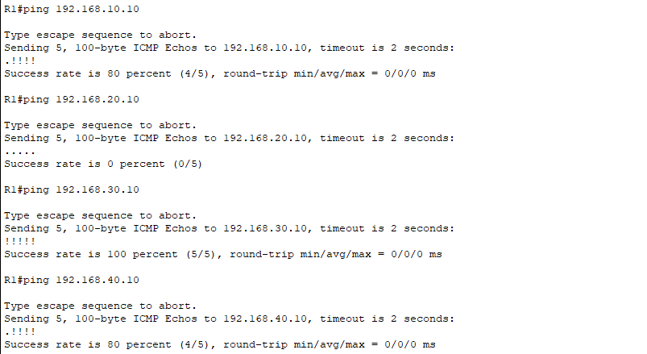

### Diagnostika

Prvním krokem bylo ověření stavu rozhraní pomocí:

```
show ip interface brief
```

Výpis potvrdil, že rozhraní je **up/up**, což znamená, že fyzická a logická vrstva fungují. To ale nevylučuje chybu v nastavení VLAN ID.

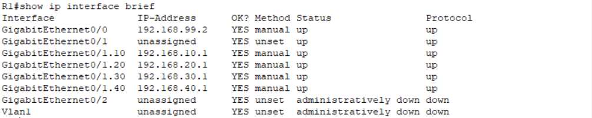

### Dalším krokem bylo zkontrolovat konfiguraci pomocí:

```
show running-config
```

Zde byla odhalena chyba – podrozhraní `GigabitEthernet0/1.20` mělo nastaveno `encapsulation dot1Q 200` místo `dot1Q 20`.

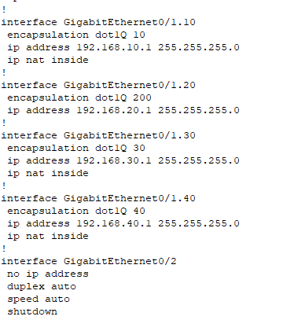

### Oprava konfigurace

Opravu provádíme přiřazením správného VLAN ID 20 na subrozhraní GigabitEthernet0/1.20 pomocí `encapsulation dot1Q 20`, čímž obnovujeme konektivitu mezi zařízeními.

**Vstup do konfigurace chybného rozhraní:**

```
configure terminal
interface GigabitEthernet0/1.20
encapsulation dot1Q 20
exit
end
write memory
```
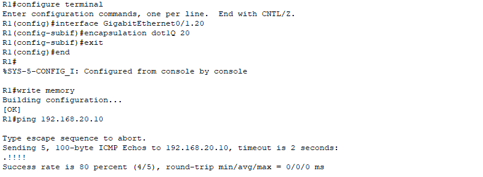

### Ověření po opravě

**Po úpravě byl proveden znovu příkaz:**

```
show running-config
```
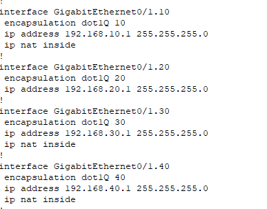

Výpis nyní ukazuje správné nastavení `encapsulation dot1Q 20`. Následné pingy z R1 i PC-2 byly úspěšné.


### Závěr

Tento scénář ukazuje, že i drobná chyba v nastavení **VLAN ID** může způsobit nefunkčnost napříč VLAN. Problém nebyl patrný na první pohled a vyžadoval kontrolu běžící konfigurace. Správná diagnostika a oprava vedly k okamžitému obnovení provozu. Takové případy jsou běžné i v praxi a ukazují důležitost pečlivé kontroly konfigurace po každé změně.


## 9.3 – NAT/PAT nepřekládá kvůli overloadu na špatném rozhraní

Po úpravě NATu na R1 se z klientských VLAN nedaří „ven“ na server `10.10.10.100`. Směrování je v pořádku, ale NAT **nevytváří překlady**. Příčina: pravidlo `overload` je omylem svázané s **rozhraním G0/1** (směr do switche), místo s **G0/0** (směr k R2).

### Zjištění problému

**Z každého PC (VLAN) posíláme ping na server:**

```
ping 10.10.10.100
```
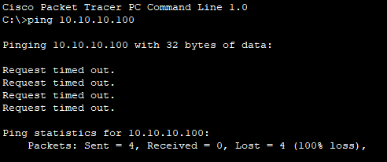

Výsledek: **Request timed out** (žádná konektivita, odpoveď od serveru).  

>**Poznámka:** pro ukázku jsme zvolili jen ping z PC-2 na server

### Diagnostika

#### NAT tabulka a statistiky na R1

**Pro výpis diagnostiky použijeme oba následující příkazy:**

```
show ip nat translations
```
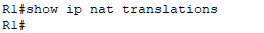

První výpis nic neukazuje, to potvrzuje, že nedochází k NAT překladům. 

```
show ip nat statistics
```
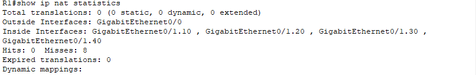

„Z `show ip nat statistics` příčinu nevyčteme. Vidíme jen inside/outside porty a počty; proto pokračujeme dašlími diagnostickými příkazy níže.

**Kontrola NAT tagů a identifikace rozhraní pro overload:**

```
show run | include ip nat outside
show run | include ip nat inside
```
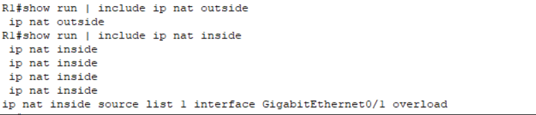

### Co z výpisu vidíme a kde nastala chyba:

```
ip nat inside source list 1 interface GigabitEthernet0/1 overload
```

**overload vážeme na G0/1**, což je rozhraní **do switche (LAN)**. Odchozí provoz do „internetu“ ale fyzicky odchází přes **G0/0** (směr k R2).

**Proč se to děje (logika):**  
Je to typická záměna „který port je ven“, příkazy jsou formálně správně, ale logicky cílí na **LAN port**, takže se překlady netvoří.

### Oprava

**Na R1 vrátíme overload na správné rozhraní **G0/0** (směr k R2):**

```
configure terminal
no ip nat inside source list 1 interface g0/1 overload
ip nat inside source list 1 interface g0/0 overload
end
write memory
```


### Ověření ping z PC-2 (VLAN 20) na server:

```
ping 10.10.10.100
```
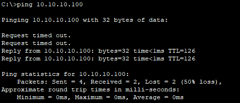

**Ping úspěšně již prochází na server**


### Ověření po opravě

**Použijeme příkaz pro NAT překlady, ověříme tak komunikaci mezi PC-2 a serverem.**

```
show ip nat translations
```


Vidíme, že se provádí překlad adres – Inside Local se převádí na Inside Global, což potvrzuje, že NAT nyní funguje správně.

### Závěr

NAT/PAT nefungoval, protože `overload` byl svázaný s **nesprávným rozhraním (G0/1)**. Přestože byla „inside/outside“ klasifikace portů v pořádku, překlady se netvořily, provoz ven totiž reálně odchází portem **G0/0**. Oprava spočívala ve správném nasměrování pravidla:


```
**ip nat inside source list 1 interface g0/0 overload**
```

Poučení: při potížích s NATem se vždy podívej na **Outside Interface** v `show ip nat statistics` a ověř konkrétní řádek s `ip nat inside source … interface <X> overload`.


## 9.4 – ACL: prohozené pořadí pravidel 

PC-4 (VLAN 40) ztratil přístup k serveru **10.10.10.100**, zatímco ostatní VLANy fungují bez problémů. Na první pohled vypadá ACL správně a je aplikováno na správném rozhraní, chyba je však v **pořadí pravidel**, tzv její logice.  

Access Control List (ACL) se vyhodnocuje **shora dolů** – jakmile dojde k první shodě, zbytek pravidel už se nekontroluje. V našem případě jsme omylem nastavili **deny** pravidlo jako první, takže povolující pravidlo pro server se už nikdy nevyhodnotí.

### Symptomy (ověření):

- Z PC-4 provedeme kontrolný ping na server: 

```
ping 10.10.10.100
``` 
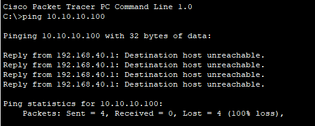

Ping z PC-4 na **10.10.10.100** neprošel – router vrací hlášení „Destination host unreachable“ u všech paketů. To potvrzuje, že provoz je blokován již na začátku vyhodnocování ACL.

### Diagnostika

1. Zkontrolovat, že je ACL opravdu připojená k rozhraní VLAN 40 (inbound):

```
show running-config | include ip access-group
```
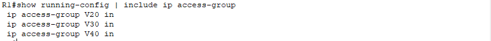

ACL V40 je skutečně aplikována na rozhraní VLAN 40 pro příchozí (inbound) provoz.

* **Podívat se na obsah ACL a pořadí:**

```
show access-lists V40
```


Uvidíme, že **první řádek je `deny … host 10.10.10.100`**, takže provoz se zablokuje už na tomto prním pravidle.  

##### **Proč se to děje z hlediska logiky:**  

**ACL se vyhodnocuje odshora dolů a platí první shoda. V našem případě tedy, pokud žádný z uvedených řádků ve výpisu ACL V40 neodpovídá, na konci se automaticky uplatní skryté pravidlo **`deny any`**, které zablokuje veškerý zbývající provoz.**

### Oprava (nastavení správného pořadí)  

V dalšímu kroku následné opravy bude nejbezpečnější způsob stávající ACL odstranit a vytvořit ji znovu, tentokrát ve správném pořadí pravidel.

**Na Router R1 zadáme:**

```
configure terminal
interface GigabithEthernet0/1.40
no ip access-group V40 in
exit
no ip access-list extended V40
ip access-list extended V40
permit icmp 192.168.40.0 0.0.0.255 host 192.168.10.10 echo-reply
permit icmp 192.168.40.0 0.0.0.255 host 192.168.40.1  echo-reply
permit ip  192.168.40.0 0.0.0.255 host 10.10.10.100    
deny ip 192.168.40.0 0.0.0.255 host 192.168.10.10
deny ip 192.168.40.0 0.0.0.255 host 192.168.99.2
deny ip 192.168.40.0 0.0.0.255 host 192.168.99.1
deny ip 192.168.40.0 0.0.0.255 192.168.20.0 0.0.0.255
deny ip 192.168.40.0 0.0.0.255 192.168.30.0 0.0.0.255
deny ip 192.168.40.0 0.0.0.255 any
exit
interface g0/1.40
ip access-group V40 in
end
write memory
```
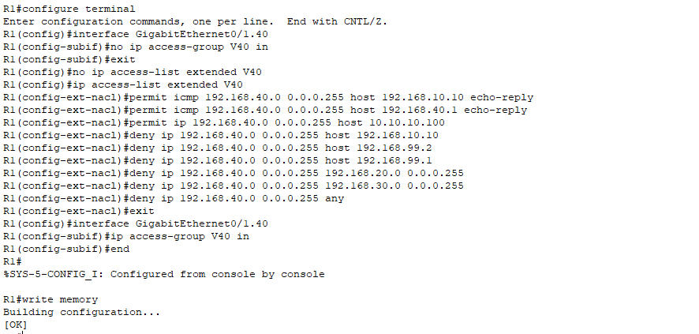


#### Ověření po opravě

- **Z PC-4 pošleme ping na server:** 

```
ping 10.10.10.100
```
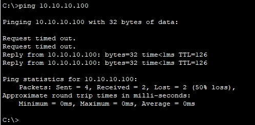

Odezva ukazuje, že **ping je úspěšný** -> server odpovídá

- **Pro kontrolu zobrazíme obsah seznamu ACL u V40:**

```
show access-lists V40
```
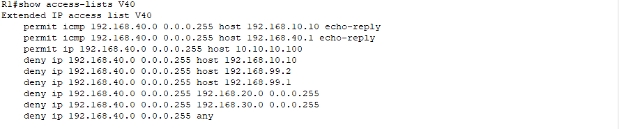

Pomocí tohoto výpisu si ověříme, že pravidlo **permit** pro adresu 10.10.10.100 už funguje správně a ping na server prochází.


### Závěr 

Po úpravě ACL jsme si ověřili, že ping z PC-4 na server už bez problémů prochází. Pomocí výpisu jsme potvrdili, že nastavené pravidlo teď funguje tak, jak má a odpovídá tomu, co jsme chtěli, tedy povolit komunikaci na správnou adresu. Díky tomu víme, že ACL je nastavené správně a síť se chová podle očekávání.

## 9.5 – Shrnutí 

V kapitole jsme postupně řešili několik záměrně vložených chyb v konfiguraci sítě. Nejprve jsme opravili nastavení NAT s parametrem _overload_, které bránilo správnému překladu adres. Následně jsme odstranili chybu v přiřazení VLAN a nastavili správné porty. Poté jsme opravili chybné pořadí pravidel v ACL, kdy bylo pravidlo _deny_ uvedeno před _permit_, což blokovalo požadovanou komunikaci. 

Každý problém jsme identifikovali pomocí diagnostiky, popsali jeho projev a ověřili správnou funkčnost po opravě. Celá kapitola ukazuje, jak důležité je rozumět logice konfigurace a umět ji číst shora dolů při hledání chyb.

Pokračovat na další kapitolu: [Shrnutí a závěr](10-shrnuti-a-zaver.md)


