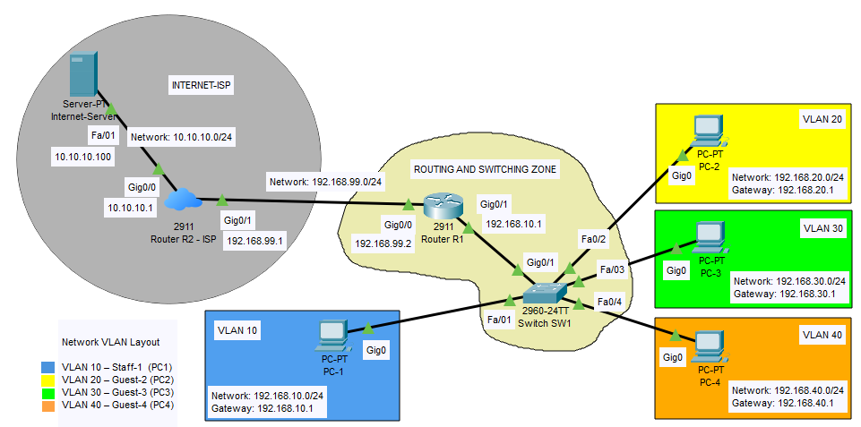

# 1 – Network Topology and Used Devices

## 1.1 – Introduction

The topology of this network is designed to accurately simulate the operation of a small business network with Internet access. It includes four PCs connected via a switch, inter-VLAN routing via the central router R1, a second router simulating an Internet Service Provider (ISP) modem, and a server providing Internet services.

**Router R1** plays a key role as the central component of the internal network – it handles inter-VLAN routing and performs NAT/PAT for outbound connectivity.  
**Router R2** acts as a simulated Internet Service Provider (ISP), forming the boundary between the internal network and the "outside world".  
**The server**, connected behind R2 in a separate network, simulates Internet services – it provides **DNS (domain name resolution)** and **HTTP (web content)**, allowing VLAN clients to test realistic connectivity scenarios.

This setup enables full testing of inter-VLAN communication and simulated Internet access in a controlled environment.

**Important note:** This project focuses solely on showcasing a wired network infrastructure – Wi-Fi is not part of the built network. The goal is to demonstrate a stable, reliable, and secure wired structure, ideal for presenting configurations and training purposes within CCNA I.

## 1.2 – Used Devices

| Device Type      | Model           | Role in the Network                                                                                                                                                                                                                                                                 |
| ---------------- | --------------- | ----------------------------------------------------------------------------------------------------------------------------------------------------------------------------------------------------------------------------------------------------------------------------------- |
| **Router R1**    | Cisco 2911      | The main router and gateway to the internal network. It ensures communication between VLANs and provides access towards the edge router R2. It performs NAT/PAT for outbound traffic from the internal VLANs. It has two gigabit ports for connections to switch SW1 and router R2. |
| **Router R2**    | Cisco 2911      | Edge router simulating an ISP gateway.   Separates the café's internal network from the server network.   Connected to R1 and uses static routes back to the VLANs.                                                                                                           |
| **Switch SW1**   | Cisco 2960-24TT | Versatile switch suitable for most CCNA I labs. Supports VLANs, port security, and various port types (Gigabit/FastEthernet).                                                                                                                                                       |
| **PC-1 to PC-4** | PC-PT (default) | Workstations placed in VLANs. Each PC is equipped with a PT-HOST-NM-1CGE module with a Gigabit (Gig0) port for quality backbone connection and higher speeds.                                                                                                                       |
| **Server**       | Server-PT       | Server simulating Internet services (DNS, HTTP) for VLAN connectivity testing.   Connected to R2.                                                                                                                                                                                |

All connections in the network use straight-through copper cables, the standard choice for connecting different device types (router ↔ switch, switch ↔ PC).

---

## 1.3 – Topology Overview – Physical Connections

| Device       | Interface | Connected To | Peer Interface | Note                                                |
| ------------ | --------- | ------------ | -------------- | --------------------------------------------------- |
| Router R1    | Gig0/1    | Switch SW1   | Gig0/1         | Main link between SW1 and R1                        |
| Router R1    | Gig0/0    | Router R2    | Gig0/1         | Connection to edge router (ISP gateway)             |
| Router R2    | Gig0/1    | Router R1    | Gig0/0         | Connection to internal network                      |
| Router R2    | Gig0/0    | Server       | Fa0            | Connected to the network with DNS and HTTP services |
| Switch SW1   | Gig0/1    | Router R1    | Gig0/1         | Main link between SW1 and R1                        |
| Switch SW1   | Fa0/1     | PC-1         | Gig0           | VLAN 10                                             |
| Switch SW1   | Fa0/2     | PC-2         | Gig0           | VLAN 20                                             |
| Switch SW1   | Fa0/3     | PC-3         | Gig0           | VLAN 30                                             |
| Switch SW1   | Fa0/4     | PC-4         | Gig0           | VLAN 40                                             |
| PC-1 to PC-4 | Gig0      | Switch SW1   | Fa0/1–Fa0/4    | Based on VLAN assignment                            |
| Server       | Fa0       | Router R2    | Gig0/0         | Simulated Internet services network                 |

---

## 1.4 – Device Naming (Display Name)

To improve orientation in the topology, all devices were assigned a **Display Name** value in:

`Config -> Global Settings -> Display Name`

Devices without CLI support (e.g., PC-PT, Server-PT) cannot have their hostname set via the CLI command. For these devices, naming was done exclusively through the GUI.

**Display Name list:**

- Router-PT (Router R1) – **Router R1**
    
- Router-PT (Router R2) – **Router R2 - ISP**
    
- Switch-PT – **Switch SW1**
    
- PC-PT (PC1) – **PC-1**
    
- PC-PT (PC2) – **PC-2**
    
- PC-PT (PC3) – **PC-3**
    
- PC-PT (PC4) – **PC-4**
    
- Server-PT – **Internet-Server**
    

**Note:** Display Name settings do not affect network functionality; they serve only for visual clarity in the GUI.

---

Continue to the next chapter: [Addressing and VLAN planning](02-addressing-and-vlan-planning.md)
