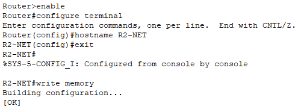
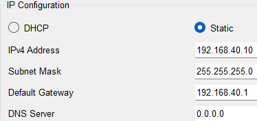

# **3 – Basic Network Configuration**


## 3.1– Introduction

This chapter focuses on the basic network configuration that prepares the environment for the next steps of the project. We will assign hostnames to devices for better orientation, set static IP addresses on routers and PCs, and configure the connection between routers R1 and R2. These steps form the essential foundation for future VLAN and routing configuration.
## 3.2 – Device Naming

In the first part of this chapter, we assign hostnames to all devices that have access to the CLI interface. This improves network orientation and makes later configuration more organized.

### Router R2 

- Works as the main router between the internal network and the server, which simulates Internet access in this project.

- Router R1 sends traffic from VLANs to R2 (interface GigabitEthernet0/1), and R2 forwards it to the server.

```
enable
configure terminal
hostname R2-NET
exit
write memory
```

### Router R1 

- Hostname: `R1`
    
- Connects our internal network to router R2 and performs address translation (NAT/PAT) for VLAN access to the server.


```
enable
configure terminal
hostname R1
exit
write memory
```

### Switch SW1

- Hostname: `SW1`
    

```
enable
configure terminal
hostname SW1
exit
write memory
```


## 3.3 – Static IP Address Configuration on Routers

According to the planning table from Chapter 3, we set IP addresses for the routers.  
Each device receives an IP address matching its planned VLAN assignment. The subnet mask is /24 (255.255.255.0) in all cases.

### Router R2 (Network Edge Router)

We configure IP address `192.168.99.1` on interface `GigabitEthernet0/1`.

```
enable
configure terminal
interface gigabitethernet0/1
ip address 192.168.99.1 255.255.255.0
no shutdown
end
write memory
```


> **Note:** Router R2 simulates an ISP and is connected to the server, which simulates Internet services. It has no default gateway and works as the endpoint towards the server.

### Connection to R2 and Port Activation with the Switch

- `Gig0/0`: Connects to R2 (IP `192.168.99.2`)
    
- `Gig0/1`: Enabled now, will be used later for VLANs
    

```
enable
configure terminal
interface gigabitethernet0/0
ip address 192.168.99.2 255.255.255.0
no shutdown
exit
interface gigabitethernet0/1
no shutdown
exit
end
write memory
```

> **Note:** The IP address `192.168.10.1` (default gateway for PC-1) will be set later in the subinterface `Gig0/1.10`, as it will be part of VLAN 10. Router-on-a-Stick with a trunk will be used.


### Confirming IP Address Configuration on the Router R1

To verify that the IP address was correctly set on R1's interface, we used a simple diagnostic command:

```
show ip interface brief
```

This command displays an overview of all interfaces and their assigned IPs. In the output, we confirmed that `GigabitEthernet0/0` has the IP address `192.168.99.2` and the status is `up`.

> **Note:** This command is great for quickly checking interface statuses and configured IP addresses on a router. The output includes columns like Interface, IP-Address, OK?, Method, Status, and Protocol.


## 3.4 – Static IP Addresses on PCs

We manually assign IP addresses to each PC using the graphical interface at **Desktop → IP Configuration**. The IP addresses correspond to the planned VLAN segmentation.

### PC-1 – Staff

- IP adress: 

```
192.168.10.10`
```
- Subnet mask: `255.255.255.0`
    
- Default gateway: `192.168.10.1`


 We used `ipconfig` to verify the configuration.


### PC-2 – Guest 

- IP adress: `192.168.20.10`

- Subnet mask: `255.255.255.0`

- Default gateway: `192.168.20.1`


### PC-3 – Guest 

- IP: `192.168.30.10`
    
- Subnet mask: `255.255.255.0`
    
- Default gateway: `192.168.30.1`


### PC-4 – Guest 

- IP: `192.168.40.10`
    
- Subnet mask: `255.255.255.0`
    
- Default gateway: `192.168.40.1`



 We configured all PCs with their required IP addresses, subnet masks, and default gateways in preparation for upcoming VLAN segmentation.

> **Note:** CLI-based configuration is not possible as Packet Tracer PCs lack IOS. However, you can verify settings using the `ipconfig` command in the **Command Prompt**.


## 3.5 – **Summary**

In this chapter, we named all network devices and configured their static IP addresses according to the addressing plan. Routers R1 and R2 were connected via a dedicated link, which in this project serves as the transition between the internal network and the server simulating the internet.  
At this stage, communication between the PCs has not yet been established, as VLANs will be configured in the next chapter.

---

Continue to the next chapter: [VLANs and subinterfaces](04-vlans-and-subinterfaces.md)

