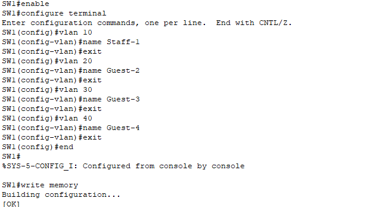
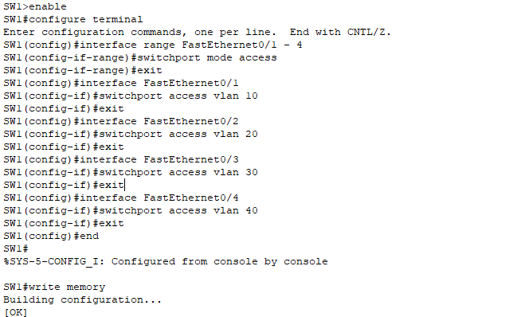
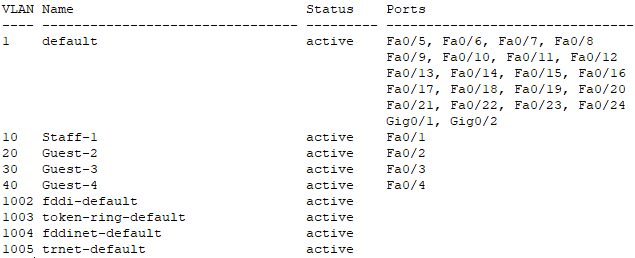
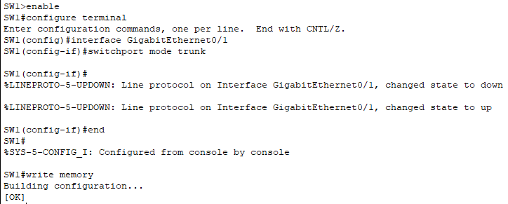
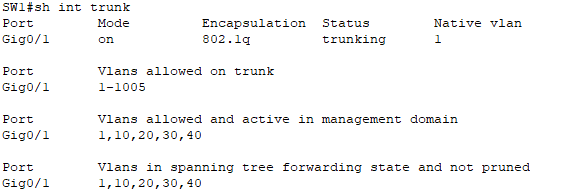
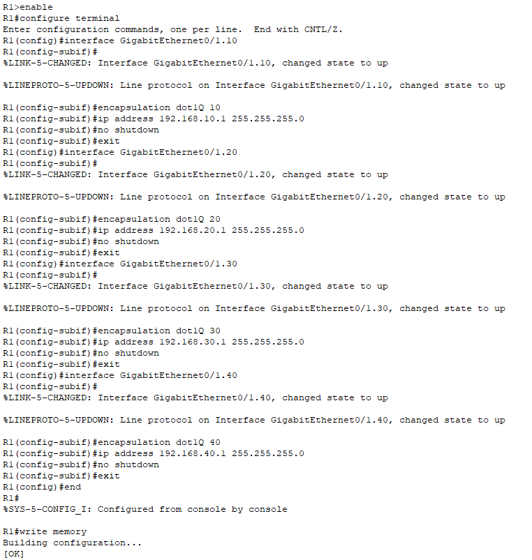
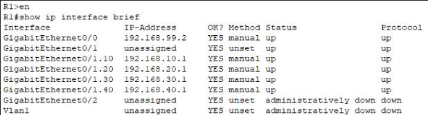
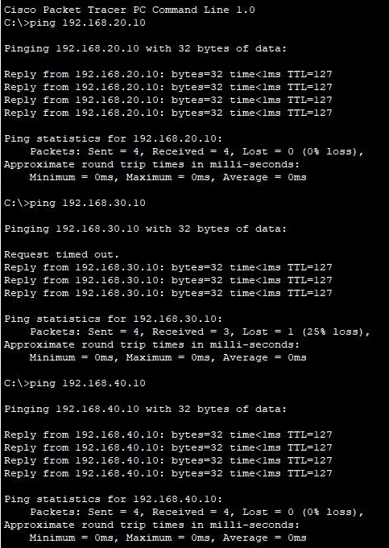
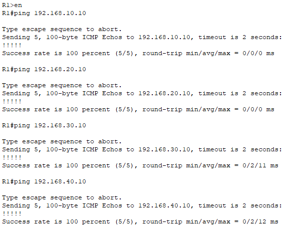

# **4 – VLANs and Subinterfaces**


## 4.1 – Introduciton

In this chapter, we will configure Virtual LANs (VLANs) and inter-VLAN routing using the Router-on-a-Stick method. This is a key step for separating network traffic between employees and guests, where communication between individual segments will pass through the central router R1. 

On the switch SW1, we will create individual VLANs, assign ports to them, configure a trunk port, and set up subinterfaces on the router to handle routing. This creates a clear and secure network.


## 4.2 – Creating VLANs on switch SW1

To divide the network into logical segments (employees, guests,), we first need to create individual VLANs on switch SW1. Each VLAN will have its own ID and name to simplify configuration management.

#### VLAN list:

|VLAN ID|Name|Description|
|---|---|---|
|10|Staff-1|Employees (PC-1)|
|20|Guest-2|Guests (PC-2)|
|30|Guest-3|Guests (PC-3)|
|40|Guest-4|Guests (PC-4)|

**Configuration on the switch:**

```
enable
configure terminal
vlan 10
name Staff-1
vlan 20
name Guest-2
vlan 30
name Guest-3
vlan 40
name Guest-4
```


VLAN 10 is labeled "Staff-1" and is used for employees – specifically PC-1, which is in the same subnet as router R1.


## 4.3 – Assigning ports to VLANs

After creating the VLANs, we need to assign physical ports on switch SW1 to the correct VLANs. This ensures each device belongs to the proper network segment.

#### Port assignments:

| Port            | VLAN | Description | Connected Device |
| --------------- | ---- | ----------- | ---------------- |
| FastEthernet0/1 | 10   | Staff-1     | PC-1 (employee)  |
| FastEthernet0/2 | 20   | Guest-2     | PC-2 (guest)     |
| FastEthernet0/3 | 30   | Guest-3     | PC-3 (guest)     |
| FastEthernet0/4 | 40   | Guest-4     | PC-4 (guest)     |

Each port on the switch can belong to only one access VLAN.

On the switch, we used the command `interface range FastEthernet0/1 - 4` to start bulk configuration of ports FastEthernet 0/1 to 0/4, so we could switch them to access mode and assign them to the appropriate VLANs.

```
enable
configure terminal
interface range FastEthernet0/1 - 4
switchport mode access
exit
interface FastEthernet0/1
switchport access vlan 10
exit
interface FastEthernet0/2
switchport access vlan 20
exit
interface FastEthernet0/3
switchport access vlan 30
exit
interface FastEthernet0/4
switchport access vlan 40
exit
write memory
```


>Note: Each device is isolated in its own VLAN, increasing security and control over network traffic. VLAN 10 (PC-1) is in the same subnet as the subinterface GigabitEthernet0/1.10 on router R1, which will be its default gateway.

### Verifying VLAN port assignments on the switch

**To verify correct VLAN port assignments on the switch, we used:**

```
show vlan brief
```


 The output showed that ports Fa0/1 to Fa0/4 were correctly assigned to VLANs 10, 20, 30, and 40 and are active.


## 4.4 – Configuring trunk port on SW1

To enable communication between VLANs and routing via R1, switch SW1 needs to carry frames from all VLANs to the router. We use a trunk port for this.

### Trunk connection:

| Port               | Type  | Description                |
| ------------------ | ----- | -------------------------- |
| GigabitEthernet0/1 | trunk | SW1 ↔ Router R1 connection |
- The trunk port allows multiple VLANs to be transmitted over a single physical cable.
    
- To activate trunk mode, we use the command:

`switchport mode trunk` 

```
enable
configure terminal
interface GigabitEthernet0/1
switchport mode trunk
exit
write memory
```


>**Note:** The `no shutdown` command was not required, as GigabitEthernet0/1 is active by default on the switch.


### Verifying trunk port (GigabitEthernet0/1)

To verify that the `GigabitEthernet0/1` port on switch SW1 is indeed functioning as a trunk and carrying the desired VLANs, we used the following command:

`show interfaces trunk`




The output confirmed:

- Port Gig0/1 is in trunk mode
    
- 802.1Q encapsulation is used
    
- All required VLANs (1, 10, 20, 30, 40) are allowed
    
- Forwarding state and not pruned
    


## 4.5 – Subinterfaces on R1 (Router-on-a-Stick)

To allow VLANs to communicate and access the internet, we must configure subinterfaces on router R1. These are logical interfaces created on the physical port GigabitEthernet0/1, connected to SW1 via the trunk.

Each subinterface represents one VLAN, has its own IP address (default gateway), and is named using the format GigabitEthernet0/1.X, where X is the VLAN ID.

#### Subinterface overview:

| Subinterface          | VLAN | IP Address   | Subnet          |
| --------------------- | ---- | ------------ | --------------- |
| GigabitEthernet0/1.10 | 10   | 192.168.10.1 | 192.168.10.0/24 |
| GigabitEthernet0/1.20 | 20   | 192.168.20.1 | 192.168.20.0/24 |
| GigabitEthernet0/1.30 | 30   | 192.168.30.1 | 192.168.30.0/24 |
| GigabitEthernet0/1.40 | 40   | 192.168.40.1 | 192.168.40.0/24 |

**Each subinterface must have:**

- identification using `encapsulation dot1Q <VLAN ID>`
    
- configuration with the corresponding IP address
    
- activation using `no shutdown`


**Configuration on router R1:**

```
enable
configure terminal
interface GigabitEthernet0/1.10
encapsulation dot1Q 10
ip address 192.168.10.1 255.255.255.0
no shutdown
exit
interface GigabitEthernet0/1.20
encapsulation dot1Q 20
ip address 192.168.20.1 255.255.255.0
no shutdown
exit
interface GigabitEthernet0/1.30
encapsulation dot1Q 30
ip address 192.168.30.1 255.255.255.0
no shutdown
exit
interface GigabitEthernet0/1.40
encapsulation dot1Q 40
ip address 192.168.40.1 255.255.255.0
no shutdown
exit
write memory
```


With this, we configured all necessary subinterfaces on R1 for the individual VLANs, and the router is now ready to route traffic between them.

### Subinterface Diagnostics

To verify that all subinterfaces on the **GigabitEthernet0/1** port (for VLANs 10–40) are active and properly configured.

We perform the diagnostics using the command: `show ip interface brief`



Confirmation:

- Subinterfaces G0/1.10 to G0/1.40 are active (up/up)
    
- Each subinterface has the correct IP address
    
- G0/1 (no IP) serves as the base for subinterfaces
    
- G0/0 (192.168.99.2) connects to R2 for NAT/PAT
    
- Other interfaces are unused
    


## 4.6 – Connectivity diagnostics

To verify correct routing, we tested connectivity using `ping` from various devices:

- **From PC-1** (VLAN 10), we successfully pinged all other PCs – PC-2 to PC-4
    
- **From Router R1**, we pinged all devices in the VLANs – access to all subnets is working

**Use the command:** `ping:`

```
192.168.20.10 (PC-2)
192.168.30.10 (PC-3)
192.168.40.10 (PC-4)
```


Use the command: `ping:`

```
192.168.10.10 (PC-1)
192.168.20.10 (PC-2)
192.168.30.10 (PC-3)
192.168.40.10 (PC-4)
```


Results confirmed successful inter-VLAN routing and connectivity with R1.


## 4.7 – Summary  


In this section, we created VLANs and assigned the corresponding ports on the switch. One of the ports was configured as a trunk to carry frames from multiple VLANs. On Router R1, we created subinterfaces for each VLAN (Router-on-a-Stick) and assigned them the appropriate IP addresses for inter-VLAN routing. Using the `ping` command and ongoing diagnostics, we verified that the PCs can communicate within their VLANs and with Router R1.

In the next chapter, we will focus on configuring static routes (`ip route`) so that the internal VLANs can communicate outside their local network through Router 2.  
We will also configure NAT/PAT on Router R1 to allow the internal VLANs to access the internet.

Continue to the next chapter: [NAT & PAT](05-nat-and-pat.md)
