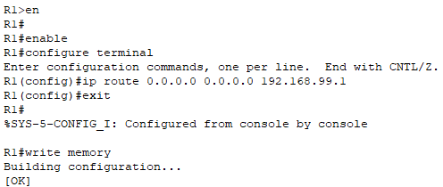
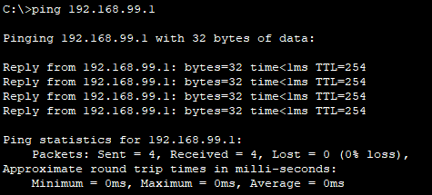

# **5 – NAT and PAT**


## 5.1 – Introduction

In this part of the project, we will configure Network Address Translation (NAT) and Port Address Translation (PAT) on Router R1.  
The goal is to provide all internal VLANs (Guest 1 to 4) and Routers R1 and R2 with access to the server, which in our topology provides simulated internet functions (such as domain name resolution – DNS).

Outbound traffic from internal networks will be translated to a single IP address 192.168.99.2 (interface GigabitEthernet0/0 on R1). Thanks to this:

- Customers and staff will have working access out, while their original internal IPs remain hidden.
    
- Router R2 will know routing information to internal networks (via static routes), but it will only see traffic under R1’s translated IP. It will not see which specific station or VLAN a packet originally came from.
    

Before the NAT/PAT configuration, we add the necessary static routing (ip route) between R1 and R2 so both routers know where to send traffic.


## **5.2 – Static routing (ip route) between R1 and R2**

Before we start NAT/PAT, we make sure both routers can deliver traffic to each other.

- **R1** must know that all traffic destined for the "internet" should be sent to **R2**.
    
- **R2** must know the routes to all internal VLANs (10–40) so it can send the replies back.

Our link between R1 and R2 is the 192.168.99.0/24 network (VLAN 99 – internet simulation).

- R1 interface (GigabitEthernet0/0) has IP 192.168.99.2
    
- R2 interface (GigabitEthernet0/1) has IP 192.168.99.1
    

**Configuration on R1 – add a default route for any traffic outside internal VLANs:**

```
enable
configure terminal
ip route 0.0.0.0 0.0.0.0 192.168.99.1
exit
write memory
```


This makes R1 send any traffic that doesn’t belong to its internal networks to R2._

**Configuration on R2 – add static routes to all café internal networks:**

```
enable
configure terminal
ip route 192.168.10.0 255.255.255.0 192.168.99.2  
ip route 192.168.20.0 255.255.255.0 192.168.99.2  
ip route 192.168.30.0 255.255.255.0 192.168.99.2  
ip route 192.168.40.0 255.255.255.0 192.168.99.2
exit
write memory
```


>**Note:** In static routes we specify the _network address with mask_ so the route applies to the entire subnet, not just a single host.

### Verifying static routing between R1 and R2

After adding static routes, we verify both routers “see” each other’s networks and traffic flows both ways.

#### **Check routing tables** 

On both routers, we display the current routing table using the command:

```
show ip route
```

**Router R1:**


This confirms R1 has all VLANs connected and an active default route (gateway of last resort) to R2, which ensures outbound traffic from internal networks._

**Router R2:**


_This confirms R2 has static routes to all internal VLANs and sends them via 192.168.99.2 to R1._

### Connectivity tests with ping

From **PC-2 (VLAN 20)** verify reachability to R2:

```
ping 192.168.99.1
```


From **R2** verify reachability to the VLAN gateways **R1:**

we use the command:`ping`

```
ping 192.168.10.1  
ping 192.168.30.1  
ping 192.168.40.1
```


## **5.3 – NAT/PAT configuration on R1**

Here we configure address and port translation on Router R1 so that internal VLANs (10–40) can communicate with the internet via R2. On `GigabitEthernet0/0` (192.168.99.2), R1 will translate all outbound traffic from internal networks to its “public” IP.


### Marking inside/outside interfaces + saving the config

This step determines which interface is the outside interface (towards the internet via R2) and which are **inside** (towards internal VLANs). Configuration runs on **Router R1**.

- Set G0/0 as outside.
    
- Set subinterfaces G0/1.10 to G0/1.40 as inside.
    

**Commands on R1:**

```
enable  
configure terminal  
interface GigabitEthernet0/0  
ip nat outside  
exit  
interface GigabitEthernet0/1.10  
ip nat inside  
exit  
interface GigabitEthernet0/1.20  
ip nat inside  
exit  
interface GigabitEthernet0/1.30  
ip nat inside  
exit  
interface GigabitEthernet0/1.40  
ip nat inside  
exit  
end  
write memory
```


### ACL for internal networks (what to translate)

To let NAT know which addresses to translate, we create an **ACL (Access Control List)**. Here we allow all four internal VLANs (10–40). Configuration runs on **Router R1**.

- Create numbered ACL 1.
    
- Add each internal VLAN subnet.
    

**Commands on R1:**

```
enable  
configure terminal  
access-list 1 permit 192.168.10.0 0.0.0.255  
access-list 1 permit 192.168.20.0 0.0.0.255  
access-list 1 permit 192.168.30.0 0.0.0.255  
access-list 1 permit 192.168.40.0 0.0.0.255  
end
write memory
```


>**Note:** In ACLs we use _network addresses with wildcard masks_ so the rule covers the whole subnet, not just a single host. This particular ACL is used **only for NAT/PAT** – it tells the router which internal networks to translate to its public address. It is **not** a security control. **Security ACLs that restrict inter-VLAN access or access to the router will be handled separately in the** _**Network Security**_ **chapter.**


### Enabling NAT/PAT (overload)

Based on the ACL, we enable NAT/PAT so all permitted addresses translate to the G0/0 address. We use **overload**, so many devices can share one public IP simultaneously. Configuration runs on **Router R1**.

- Activate NAT/PAT for ACL 1 on interface G0/0 with `overload`.
    

**Commands on R1:**

```
enable  
configure terminal  
ip nat inside source list 1 interface GigabitEthernet0/0 overload  
end
write memory
```

_Now NAT/PAT is configured and ready to use._

>**Note:** NAT/PAT applies only on the interface that leads to the internet (**outside**).In our case, it is G0/0 because it is connected to the border router R2, behind which is a server simulating internet functions. **G0/1** is inside (our LAN) and we don’t apply NAT there. In the command `ip nat inside source`, the word _inside_ does **not** mean NAT runs on G0/1 – it simply says we translate **source addresses from the inside** to the public address of the outside interface. Which interface is inside/outside is defined separately with `ip nat inside` / `ip nat outside` under the specific interfaces.


### NAT/PAT diagnostics

After configuration, we verify NAT/PAT works properly.

**On R1:**

```
enable  
show ip nat statistics
```

**Explanation of the output:**

- **Outside Interface** is correctly set to `GigabitEthernet0/0`, which is the port facing the internet.
    
- **Inside Interfaces** include subinterfaces `GigabitEthernet0/1.10`, `.20`, `.30`, and `.40`, which correspond to VLANs 10–40.
    
    This confirms that NAT is correctly configured for all VLANs.
    
- In our case, the values are 0 because no traffic has yet passed from the internal network to the outside through NAT.
    

>**Note:** `show ip nat translations` displays the specific active translations (e.g., original and translated IPs/ports). If the table is empty, it means that no traffic has yet passed through NAT or that the translations have already expired.


**Connectivity pings (to confirm ICMP isn’t blocked):**

To confirm that NAT/PAT is not blocking ICMP traffic (pings), we will test the connection in both directions.

- From a VLAN PC (e.g., **PC-2 – 192.168.20.10**) ping **R2**:
    
    ```
    ping 192.168.99.1
    ```



- From **R2** ping VLAN gateways on **R1**:
    
    ```
    ping 192.168.10.1
    ping 192.168.20.1
    ping 192.168.30.1
    ping 192.168.40.1
    ```


**Conclusion:** All test pings were successful, confirming correct NAT/PAT behavior and connectivity between the internal network and the simulated internet.

---
# 5.4 – Summary

In this chapter we successfully configured NAT and PAT on Router R1, letting all internal devices use a single public IP to reach the internet. We marked outside/inside interfaces, created a translation ACL, enabled overload, and verified operation with pings and diagnostic commands. With NAT/PAT confirmed, the network is ready for the next steps of the project (DNS and WIFI).