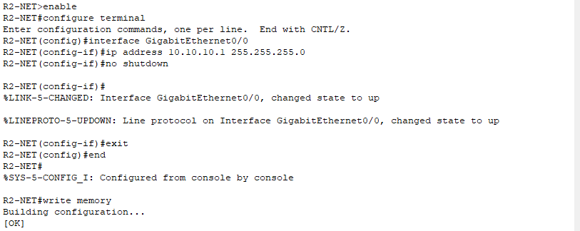
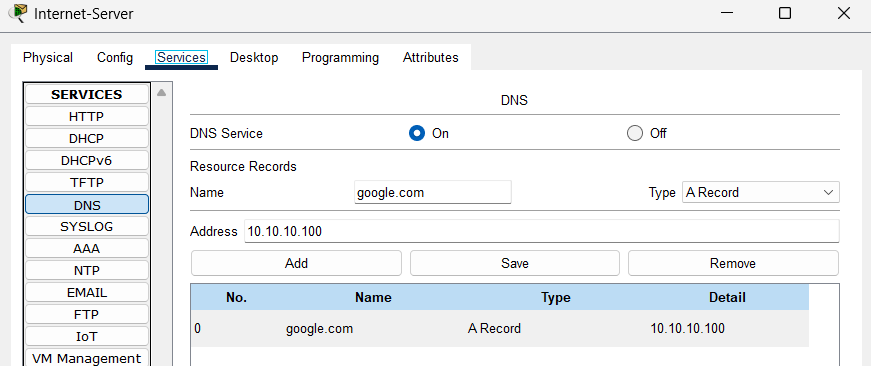

# **6 – Internet and DNS**


## 6.1 – Introduction

Here we connect our network to a simulated internet, represented by a server located behind the border router R2.  
This server will provide domain name resolution (DNS) and a simple HTTP service for functionality verification.

First, we configure the G0/0 interface on R2 toward the server, and on the server, we manually set the IP address, mask, and gateway.  
Then, on the server, we create DNS records, enable the HTTP service, and test access from PCs in the VLAN using both a domain name and a website.

Finally, we verify that requests from VLANs pass through NAT/PAT on R1 and are correctly translated by the server.


## 6.2 – Setting the IP Address on the Server

In this step, we assign a static IP address to the Internet-Server so it can communicate with the border router R2 and provide services to our network.

On the server, open **Desktop → IP Configuration** and switch the mode to **Static**.  
Fill in the following fields:


* IPv4 Address: 10.10.10.100  
    
* Subnet Mask: 255.255.255.0  
    
* Default Gateway: 10.10.10.1  
    
* DNS Server: 0.0.0.0


The server thus obtains a fixed address in the network between it and router R2, which allows it to act as a service provider such as DNS or HTTP.


>**Note:** We leave the DNS server set to 0.0.0.0 because this server itself acts as the DNS for the entire network and does not need to forward queries elsewhere.


## 6.3 – Setting the IP Address on Router R2 Port G0/0

On router R2, it is necessary to configure the GigabitEthernet0/0 interface so that it is in the same network as the Internet-Server and can route traffic between the server and the rest of the network.

For port G0/0, we enter the following commands:


```
enable  
configure terminal  
interface GigabitEthernet0/0  
ip address 10.10.10.1 255.255.255.0  
no shutdown  
exit  
end  
write memory
```



>**Note:** We use the address of router R2 as the default gateway because it handles routing outside this subnet.

After applying the settings, the interface is active and ready to communicate with the server.  
The server and router are now in the same subnet, which enables direct connection and access to the provided services such as DNS and HTTP.

#### Connection Diagnostics to the Server

* From PC3, execute the command to the Internet-Server address:

```
ping 10.10.10.100
```


* From Router R1, also run the same command:

```
ping 10.10.10.100
```


The ping is successful in both cases, confirming proper connection of the client and the router to the Internet Server and working communication in the network.


## 6.4 – Configuring DNS and HTTP Services on the Server

On the server, we enable DNS and HTTP services so that it can provide domain name resolution and also act as a simple web server for testing.

DNS (Domain Name System) is a service that translates domain names (e.g., google.com) into corresponding IP addresses.

#### DNS Service

* Go to **Services → DNS**  

* Enable the DNS service (On)  

- Add a new record: Name: google.com (example)  

- Address: e.g., 10.10.10.100 (IP address of our local web server)  

* Save the record.




>**Note:** The DNS record is used to assign an IP address to a domain name. The HTTP service then allows displaying a webpage directly from this server.  
In Packet Tracer, it is recommended to use the address of a device that actually exists in the simulation and provides the service in question. Real public addresses (e.g., 8.8.8.8) will not work here because the network is not connected to the internet all traffic remains within the simulation.

#### HTTP Service

Here we set up HTTP (Hypertext Transfer Protocol). HTTP is a network protocol used for transferring web pages and other data between a web server and a client (e.g., a web browser).

* Go to **Services → HTTP**  

* Enable the HTTP service (On)


## 6.5 – Testing from Client PCs

Now we focus on testing the functionality of the entire network configuration.  
The goal is to verify that the individual services (DNS, HTTP) and the internet connection in the simulated environment work as expected.

On PC-2, in the network adapter configuration, set the DNS server to **10.10.10.100** so that domain name resolution is handled by our local server.

On a PC in VLAN20, open **Command Prompt** and enter:

```
ping google.com
```


Open a web browser and enter:

```
google.com
```

The ping in **Command Prompt** was successful and verification in the browser on PC-2 confirmed that domain name resolution through our DNS server works entering google.com loaded the test page from the server’s HTTP service.


## 6.6 – NAT/PAT Diagnostics

After successfully enabling the DNS service and loading the simulated google.com website, we perform the necessary diagnostics of the PAT/NAT function.  
We check whether the translation of private IP addresses to public ones works correctly and whether connectivity between the internal network and the simulated internet is ensured.

On R1, check the address translation with the command:

```
enable  
show ip nat translations
```


The `show ip nat translations` output confirms functional NAT/PAT from PC-20 (192.168.20.10) successfully translated to Inside Global and communicating with destination addresses (e.g., 10.10.10.100).  
DNS and HTTP services on the server are fully functional and verified by testing within the network.


## 6.7 – Summary

In this chapter, we successfully connected our internal network to a simulated internet through router R2.  
On R2, we configured the port toward the server, which is located in a separate network, and ensured its availability for clients.  
On the server, we set up and enabled the DNS service for domain name resolution and the HTTP service for web access.  
We verified that client PCs can successfully ping the server using its IP address and name, and also load a webpage from the HTTP server.  
Diagnostics confirmed the functionality of both services and the readiness of the network for the next step, which will be the chapter dedicated to network security and the configuration of protective measures against unauthorized access.