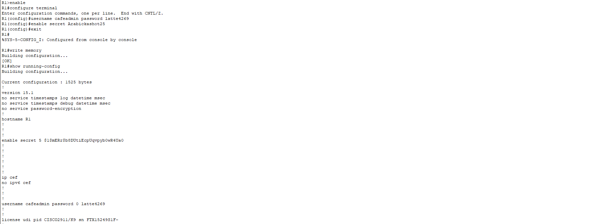
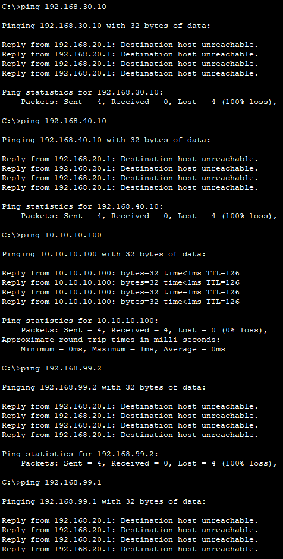

# **7 – Network Security**


## 7.1 – Introduction

Security is essential for any network. Even a well-designed topology is vulnerable if it is not protected against unauthorized access and misuse. In this chapter, we will show how to turn the café’s model network into a reliable and secure environment.

We will go through the basic steps, such as setting up user accounts and passwords, login warning banners, limiting connections using **Port Security**, and disabling unused ports. Finally, we will focus on **Access Control Lists (ACLs)**, which define who can communicate within the network.

The goal is to create a network that is functional and at the same time resistant to common threats in a local environment.

## 7.2 – Login with Username and Password + Enable Secret Password for Privileged Mode

To ensure that only authorized users can access the device, we will configure a local account with a username and password (**username + password**) and also set an **enable secret** password for privileged mode.

Upon login, the device will first request the username and password, and then, when switching to privileged mode, it will require the **enable secret** password.

For this first project, we will use the combination **password + service password-encryption** so we can observe how the configuration hides the password.  
In the next project, we will use **secret**, which is automatically encrypted.

This configuration will be applied to routers **R1**, **R2**, and the switch.

The command sequence is as follows:

```
enable
configure terminal
username cafeadmin password latte4269
enable secret Arabickashot25
exit
write memory
```


When we now look at the configuration (`show running-config`), for example on Router R1, the password for the `username` is visible in plain text.



To hide it, we use the following command:

```
enable
configure terminal
service password-encryption
end
write memory
```


After displaying the configuration again, the passwords will be encrypted.


## 7.3 – Securing Console Access (login local)

To ensure the device prompts for a username and password when connecting via the console, we enable local login:

```
enable
configure terminal
line console 0
login local
end
write memory
```


This ensures that a user must enter login credentials immediately upon accessing the device through the console.

### Verifying Login and Password

1. Log out from the device (**Logout**).
    
2. Log in again – you will see:


_Username:_  
_Password:_

After entering the correct credentials, we access the user mode (`>`).

By using the `enable` command, we enter the privileged mode (`#`) after providing the enable secret password.

We verify that the passwords are encrypted by using the command:

```
show running-config
```


>**Note:** For documentation purposes, the configuration and diagnostics were performed only on Router R1 as a representative example to avoid unnecessary repetition of identical steps on other devices. The same procedure applies to other types of security.

## 7.4 – Warning Banners on Login (MOTD + Login Banner)

Warning banners inform anyone connecting to the device that access is restricted. They are displayed **before** login and serve as important security and legal measures.

We will configure two types of banners:

- **MOTD banner:** A general warning displayed before the login prompt.
    
- **Login banner:** A specific warning displayed right before entering the username and password.
    

When setting up a banner, it is necessary to choose a delimiter (e.g., `#`) and place this character both before and after the banner text so that the router knows where the text begins and ends.

Examples we will use for the configuration:

```
enable
configure terminal
banner motd #Unauthorized access is prohibited#
banner login #Restricted area – authorized personnel only#
end
write memory
```


These banners are configured on routers **R1**, **R2**, and the switch.

>**Note:** The login banner will also be displayed when connecting via Telnet/SSH or through the console to the device.

### Verifying MOTD Banner

After logging out and logging back in, both the MOTD banner and the login banner will be displayed before the username prompt, confirming that they are correctly configured.


**Note:** On switches in Packet Tracer (e.g., Cisco 2960), the `banner login` command is not supported, only `banner motd`. If we want to display multiple warnings, they must be combined into a single MOTD banner and separated by a new line.

## 7.5 – Securing Telnet Access (VTY lines)

Telnet is a network protocol that allows remote access to a network device via the command-line interface. If it is not secured, anyone on the network can gain access to the router or switch.

By configuring a password (and optionally a username) on the so-called **VTY lines** (virtual terminal lines), we ensure that Telnet access is permitted only to authorized users.

Once this configuration is applied, any PC in the network that tries to connect to a network device via Telnet will be prompted to enter login credentials.

This protects the network from unauthorized access from other PCs to network devices.

### Telnet Security Configuration

**Procedure for each network device (R1, R2, SW1):**

- Connect to the device via **CLI Console** in Packet Tracer.
    
- Set a username and password for Telnet.
    
- Enter the VTY line configuration (0 to 4 for a maximum of 5 simultaneous Telnet sessions).
    
- Enable authentication using user accounts.
    
- Enable the Telnet protocol (in Packet Tracer it is usually enabled, but we will set it explicitly).
    

```
enable
configure terminal
username cafeadmin password Espresso25
line vty 0 4
login local
transport input telnet
end
write memory
```


>**Note:** During Telnet setup, we entered the password for `cafeadmin` again, which replaced the original password with the new one (`Espresso25`). This happens because the `username` command always overwrites the password when used again.

### Verifying the Configuration

- On any PC in the network, open the **Command Prompt** (Desktop → Command Prompt).
    
- Enter the command to connect to the device, for example:
    

`telnet 192.168.10.1`  (IP adresa R1)


- The following prompt will appear:
    

User Access Verification  
Username:  
Password:


- Entering the correct username and password grants access to the device's CLI.
    
- Entering incorrect credentials will logically result in the connection being denied.
    
- In the Command Prompt, we can also see the active banners configured in the previous chapter.
    

>**Note:** All passwords used above are inspired by the theme of our model café and are intended solely for demonstration within the project. They are not as strong as those used in a real-world environment.

## 7.6 – Port Security on Active Ports

**The purpose of this feature is to protect all in-use ports (employee and customer) from unauthorized device swapping.**

Port Security is a switch feature that limits how many and which MAC addresses are allowed on a specific port. If someone disconnects a device and connects another, the switch will either block the connection or execute a configured action (e.g., `shutdown`).
This helps protect the network from unauthorized devices. 


**Procedure:**

1. In configuration mode, select the desired port.
    
2. Configure Port Security and allow only one MAC address on the port.
    
3. Set the violation action to `shutdown`.
    
4. Save the configuration.
    

**Configuration steps:**

- **PC-1 – VLAN 10 (Fa0/1)**

```
enable
configure terminal
interface Fa0/1
switchport mode access
switchport access vlan 10
switchport port-security
switchport port-security maximum 1
switchport port-security violation shutdown
switchport port-security mac-address sticky
exit
```

- **PC-2 – VLAN 20 (Fa0/2)**

```
interface Fa0/2
switchport mode access
switchport access vlan 20
switchport port-security
switchport port-security maximum 1
switchport port-security violation shutdown
switchport port-security mac-address sticky
exit
```

- **PC-3 – VLAN 30 (Fa0/3)**

```
interface Fa0/3
switchport mode access
switchport access vlan 30
switchport port-security
switchport port-security maximum 1
switchport port-security violation shutdown
switchport port-security mac-address sticky
exit
```

- **PC-4 – VLAN 40 (Fa0/4)**

```
interface Fa0/4
switchport mode access
switchport access vlan 40
switchport port-security
switchport port-security maximum 1
switchport port-security violation shutdown
switchport port-security mac-address sticky
end
write memory
```


**Brief explanation of the configuration:**

- **MAC address** – a unique identifier of a network card used by the switch to determine whether an authorized device is connected.
    
- **Maximum number of MAC addresses** – specifies how many different devices can be allowed on the port.
    
- **Violation mode** – the action taken when a violation occurs (e.g., the port shuts down, or it can be set to log-only mode).


## 7.7 - Administratively Shutting Down Unused Ports

**Goal:** Prevent unauthorized connections through unused switch ports.

**Introduction:** Inactive ports on a switch are a common security vulnerability – anyone could connect their own device and gain access to the network. Therefore, it is standard practice to administratively shut down all unused ports. In our topology, this means ports **Fa0/5–Fa0/24** and **Gi0/2**.

**Procedure:** Shut down all ports that are not part of the active topology. In our case, this applies to all ports from **FastEthernet0/5** to **FastEthernet0/24** and port **GigabitEthernet0/2**.

For each port, use the following commands:

```
interface (port_range)
shutdown
```

Alternatively:

```
interface range fa0/5 – 24 , gi0/2
shutdown
```


**Explanation:** This step prevents unauthorized devices from being connected to unused ports. If someone physically connects a cable to one of the disabled ports, **no connection will be established**.

### Verifying Functionality

To verify functionality, we can use two commands that will display both the port security configuration and the administratively disabled ports.

```
show ip interface brief
```


```
show running-config
```


The output confirms that port security is active on the desired ports and that unused ports have been successfully administratively shut down.

## 7.8 – Access Control List (ACL)

In this section, we focused on access control between VLANs and devices in the network using **Access Control Lists (ACLs)**.

ACLs allow us to permit or deny certain types of traffic based on IP addresses, protocols, and ports.

Our goal was to create rules so that:

- **PC-1 (VLAN 10)** has access to all other VLANs and the server.
    
- Other VLANs (20, 30, 40) have access only to the server (for DNS and HTTP) and cannot communicate with each other.
    
- Access from Routers R1 and R2 is maintained for necessary diagnostics (ping) and management.

This approach ensures network segmentation and functionality according to our configured rules while also protecting individual VLANs from unauthorized access.

### ACL Configuration 

We applied the configuration **to the subinterface of Router R1** towards individual VLANs (`inbound`) so that traffic is filtered before entering the target VLANs.

#### ACL Configuration For VLAN 20

```
enable
configure terminal
ip access-list extended V20
permit icmp 192.168.20.0 0.0.0.255 host 192.168.10.10 echo-reply
permit icmp 192.168.20.0 0.0.0.255 host 192.168.20.1 echo-reply
permit ip 192.168.20.0 0.0.0.255 host 10.10.10.100
deny ip 192.168.20.0 0.0.0.255 host 192.168.10.10
deny ip 192.168.20.0 0.0.0.255 host 192.168.99.2
deny ip 192.168.20.0 0.0.0.255 host 192.168.99.1
deny ip 192.168.20.0 0.0.0.255 192.168.30.0 0.0.0.255
deny ip 192.168.20.0 0.0.0.255 192.168.40.0 0.0.0.255
deny ip 192.168.20.0 0.0.0.255 any
exit
interface g0/1.20
ip access-group V20 in
exit
end
write memory
```


#### ACL Configuration for VLAN 30

```
ip access-list extended V30
permit icmp 192.168.30.0 0.0.0.255 host 192.168.10.10 echo-reply
permit icmp 192.168.30.0 0.0.0.255 host 192.168.30.1 echo-reply
permit ip 192.168.30.0 0.0.0.255 host 10.10.10.100
deny ip 192.168.30.0 0.0.0.255 host 192.168.10.10
deny ip 192.168.30.0 0.0.0.255 host 192.168.99.2
deny ip 192.168.30.0 0.0.0.255 host 192.168.99.1
deny ip 192.168.30.0 0.0.0.255 192.168.20.0 0.0.0.255
deny ip 192.168.30.0 0.0.0.255 192.168.40.0 0.0.0.255
deny ip 192.168.30.0 0.0.0.255 any
exit
interface g0/1.30
ip access-group V30 in
exit
end
write memory
```


#### ACL Configuration for VLAN 40

```
ip access-list extended V40
permit icmp 192.168.40.0 0.0.0.255 host 192.168.10.10 echo-reply
permit icmp 192.168.40.0 0.0.0.255 host 192.168.40.1 echo-reply
permit ip 192.168.40.0 0.0.0.255 host 10.10.10.100
deny ip 192.168.40.0 0.0.0.255 host 192.168.10.10
deny ip 192.168.40.0 0.0.0.255 host 192.168.99.2
deny ip 192.168.40.0 0.0.0.255 host 192.168.99.1
deny ip 192.168.40.0 0.0.0.255 192.168.20.0 0.0.0.255
deny ip 192.168.40.0 0.0.0.255 192.168.30.0 0.0.0.255
deny ip 192.168.40.0 0.0.0.255 any
exit
interface g0/1.40
ip access-group V40 in
exit
write memory
```

### Configuration Explanation

- **permit icmp ... echo-reply** – Allows ping replies from PC-1 and R1 to enable diagnostics.
    
- **permit ip ... server** – Grants access to the server (DNS and HTTP).
    
- **deny ip ... host PC-1** – Blocks unauthorized access from VLAN 20 to PC-1 (except for allowed pings).
    
- **deny ip ... host R1/R2** – Prevents direct access to the routers.
    
- **deny ip ... VLAN 30/40** – Isolates VLANs from each other.
    
- **deny ip ... any** – Implicitly denies all other traffic.
    

The same principle was applied for VLAN 30 and VLAN 40, with only the addresses adjusted accordingly.

### Conclusion

By implementing ACLs, we achieved the following:

- PC-1 has full access to all other VLANs.
    
- VLANs 20, 30, and 40 have access only to the server and for diagnostic pings, but not to each other.
    
- Access from VLANs to routers R1 and R2 is restricted, increasing security.
    
- DNS and HTTP communication works across VLANs, giving users access to a simulated internet.
    

This method of setting up ACLs is clear, repeatable, and suitable for use in CCNA I training.

### ACL Diagnostics

After deploying ACLs, we verified that the rules work as expected. Tests were conducted from various VLANs towards other VLANs, routers, and the server.

**Testing procedure:**

1. **Ping from PC-1 (VLAN 10)**
    
    - Verified access to all devices in VLANs 20, 30, and 40 → **OK**
        
    - Verified access to the server **10.10.10.100** → **OK**


>**Note:** The ping direction is allowed only from PC-1 towards internal VLANs (20, 30, 40). The reverse direction from these VLANs to PC-1 is intentionally blocked to increase security. This setup protects PC-1 (e.g., an administrator’s computer) from unauthorized access from other segments while still allowing verification of connectivity and ACL functionality from the main PC.

2. **Ping from PC-2 (VLAN 20)**
    
    - Ping to PC-1 → **FAILED** (blocked for ACL security reasons)
        
    - Ping to PC-3 and PC-4 (VLANs 30 and 40) → **FAILED** (blocked by ACL)
        
    - Ping to server **10.10.10.100** → **OK** (required for DNS/HTTP service access)
        
    - Ping to R1 (192.168.99.2) → **FAILED** (denied for better network security)
        
    - Ping to R2 (192.168.99.1) → **FAILED** (blocked by ACL)




>**Note:** The same results were recorded during testing from PC-3 (VLAN 30) and PC-4 (VLAN 40) because the ACL for these VLANs follows the same logic and rule order as VLAN 20.

3. **Ping from Router R1**
    
    - Access to all VLAN gateways → **OK** (The ACL does not block pings sent from R1 to the VLANs, and the replies are successfully received).
        
    - Ping to server **10.10.10.100** → **OK**
        
    - Ping to edge Router R2 → **OK**


**ACL has therefore fulfilled its purpose – it set precise boundaries for access between VLANs and ensured that the network remains organized and secure.**

## 7.9 – Summary  

In this chapter, we gradually secured the network – starting from banners and passwords (enable secret, Telnet), through Port Security and disabling unused ports, up to ACL to restrict communication between VLANs and allow both key network devices (Routers, PC-1) and essential services like DNS and HTTP.  

The result is an **isolated but fully functional network**, protected by precise **security rules** that minimize the risk of unauthorized access and ensure reliable and controlled operation of the entire café’s network infrastructure.
