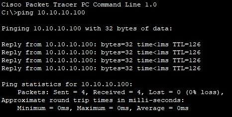

# 8 – Connectivity Testing


## 8.1 – Introduction

In this chapter, we will perform targeted diagnostics to confirm the functionality of the entire network after configuring all components from chapters 1–7.

The goal is to briefly and clearly verify that all the main network components are working together according to the design.

**Note:** We are testing only the essential connectivity elements, as complete tests of each part were conducted continuously in previous chapters.


## 8.2 – Verifying Basic Connectivity between R1 and R2

**Test purpose:** Verify that the physical connection between the central router R1 and the edge router R2 is functional and allows two-way communication.

**Command used:**

```
ping 192.168.50.2
```

**Verification:** A ping was sent from R1 to the R2-NET interface. The reply confirmed that the link is operational.


**Conclusion:** The connection between R1 and R2 is fully functional, with successful bidirectional communication.


## 8.3 – Verifying VLAN Routing and Functionality

**Test purpose:** Verify that VLAN communication works as designed – routing between VLANs is active, and the switch configuration matches the planned setup.

**Commands used:**

`ping 192.168.30.10 (ping from PC-1 to PC-3)`

`show vlan brief` on SW1 – check VLAN names and active ports

**Verification:** The ping from PC-1 to PC-3 in another VLAN was successful. The VLAN list from SW1 confirmed that VLAN names and port assignments match the configuration plan.


**Conclusion:** VLANs are correctly created, ports are assigned as per design, and inter-VLAN routing works without issues.

## 8.4 – Verifying NAT/PAT and Server Access

**Test purpose:** Confirm that NAT/PAT on R1 translates addresses and allows access to the server.

**Commands used:**

 *  `ping 10.10.10.100 ` from R1 to the server

 *  `ping 10.10.10.100 ` from  PC-2 to the server

 *  `show ip nat translations ` on R1 – check active translations

**Verification:** Both pings from R1 and PC-2 to the server were successful. The NAT table on R1 displayed correct translations from internal to public IP addresses.





**Conclusion:** NAT/PAT functions properly and enables internal VLANs to access the server without connectivity issues.

## 8.5 – Verifying DNS and HTTP Service

**Test purpose:** Verify that DNS resolution and the HTTP service on the server are available and functional.

**Commands used:**

- `ping google.com` from PC-4 – verify DNS resolution
    
- Open a web browser and enter `google.com` (displaying the test page from the HTTP service)


**Conclusion:** DNS and HTTP services are fully operational, ensuring that clients can resolve domain names and access hosted content.

## 8.6 – Verifying Network Security (ACL and Port Security)

**Test purpose:** Confirm that ACL rules and port security settings work as intended, blocking unauthorized access while allowing permitted traffic.

**Commands used:**

`ping <IP>` from R1 to all VLANs and the server


`ping <IP>` from PC-2 to all other VLANs (verification of isolation between customer VLANs)


`ping <IP>` from PC-1 to all other VLANs (verification of successful connectivity) and also ping to R1, R2, and the server. This confirms that PC-1 has full access to the entire network as the main workstation for the café staff.


`show port-security` (SW1 – port security status)


`show ip interface brief` (SW1 – verification of administratively shut down ports)


**Conclusion:**  
The tests confirmed that the configured security rules (Port Security and ACL) work correctly – unauthorized communication between customer VLANs is blocked, while approved access to VLANs, key routers, and the server is allowed. Port Security actively protects the network from unauthorized device connections, and shutting down unused ports minimizes the risk of unauthorized access.


## 8.7 – Summary

In this chapter, we conducted targeted verification of the entire network’s functionality after completing the configuration from previous chapters. The testing focused on key elements such as router interconnection, VLAN routing, NAT/PAT functionality, DNS and HTTP service availability, and verification of security measures (Port Security, ACL).

Complete tests of individual network segments had already been carried out throughout the previous chapters, so here we focused only on the most important scenarios. The results confirmed that the network operates as designed, and all tested services are either correctly accessible or blocked from a security perspective.

Routing and address translation also function correctly, and the security rules effectively protect the network against unauthorized access.


