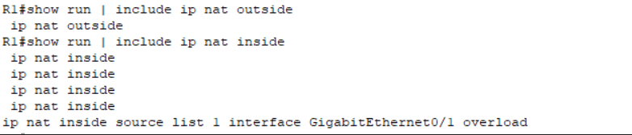

# 9 – Troubleshooting


## 9.1 – Introduction

Even with careful configuration, a small but critical error can slip in, disrupting the operation of the entire network. A simple typo or entering an incorrect value can cause the network to stop functioning as expected. In such cases, it is essential to quickly recognize the symptoms of the problem, determine its cause, and restore functionality.

This chapter contains three scenarios based on the real configuration of this project. For each scenario, we describe the problem itself, the diagnostic process, the fix, and the final verification. The goal is not only to present the solution but also to demonstrate the thought process behind it—showing how troubleshooting is performed in practice when managing a network.

>**Note:** In this project, we intentionally created several faulty scenarios to simulate common network issues. The purpose was to practice diagnosing and fixing configuration problems.

## 9.2 – Incorrect VLAN ID Configuration on Subinterface

While configuring router R1, an incorrect VLAN ID was mistakenly set on one of the subinterfaces (**GigabitEthernet0/1.20**). Instead of the correct **dot1Q 20**, the value **dot1Q 200** was entered. Such an error might not be immediately obvious and could only become apparent during connectivity testing.

From PC-2 (VLAN 20), we ran the **ping** command to PC-3 (VLAN 30) with the IP address **192.168.30.10**. The result showed a **Request timed out**, which indicates that communication between these devices was not functional, meaning there had to be a misconfiguration.

_PC-2: ping to PC-3 (VLAN 30)_

```
ping 192.168.30.10
```


Request timed out

### Verifying the Problem from Router R1

To confirm the issue, we moved to router R1 and ran ping tests to devices in all VLANs.

_R1: ping to VLAN 10, 20, 30, 40_

```
192.168.10.10
192.168.20.10
192.168.30.10
192.168.40.10
```

The results showed that pings were successful for all VLANs except **VLAN 20 (PC-2)**. This clearly indicated that the problem was related to VLAN 20 and the communication between R1 and PC-2.


### Diagnostics

**The first step was to verify the status of the interfaces using:**

```
show ip interface brief
```

The output confirmed that the interfaces were **up/up**, meaning both the physical and logical layers were operational. This ruled out any physical issue but did not exclude a misconfiguration of the VLAN ID.


### The next step was to check the configuration using:

```
show running-config
```

Here, the issue was revealed – the subinterface **GigabitEthernet0/1.20** was configured with **encapsulation dot1Q 200** instead of **dot1Q 20**.


### Fixing the Configuration

The fix was applied by assigning the correct VLAN ID 20 to the subinterface **GigabitEthernet0/1.20** using the command **encapsulation dot1Q 20**, restoring connectivity between the devices.

**Entering the configuration of the incorrect subinterface:**

```
configure terminal
interface GigabitEthernet0/1.20
encapsulation dot1Q 20
exit
end
write memory
```


### Verification After the Fix

**After the fix, we ran the following command again:**

```
show running-config
```


The output now showed the correct **encapsulation dot1Q 20** configuration. Subsequent pings from both R1 and PC-2 were successful.


### Conclusion

This scenario demonstrates that even a small error in VLAN ID configuration can cause connectivity failures across VLANs. The problem was not immediately apparent and required checking the running configuration. Correct diagnostics and a quick fix led to the immediate restoration of service. Such cases are common in practice and highlight the importance of thoroughly verifying configuration after every change.

## 9.3 – NAT/PAT Not Translating Due to Overload on the Wrong Interface

After modifying NAT on R1, it was not possible to reach the server **10.10.10.100** from the client VLANs. Routing was correct, but NAT did not perform translations. The cause: the **overload** rule was mistakenly linked to interface **G0/1** (toward the switch) instead of **G0/0** (toward R2).

### Identifying the Problem

**From each PC (VLAN), we sent a ping to the server:**

```
ping 10.10.10.100
```


Result: **Request timed out** (no connectivity, no response from the server).

>**Note:** For demonstration purposes, we only show the ping from PC-2 to the server.


### Diagnostics – NAT Table and Statistics on R1

**For diagnostic output, we use the following two commands:**

```
show ip nat translations
```


The first output shows nothing, confirming that no NAT translations are occurring.

```
show ip nat statistics
```


From `show ip nat statistics`, we cannot determine the cause. We only see the inside/outside interfaces and counters, so we proceed with additional diagnostic commands below.

**Checking NAT tags and identifying the interface for overload:**

```
show run | include ip nat outside
show run | include ip nat inside
```


### What the Output Shows and Where the Error Occurred:

```
ip nat inside source list 1 interface GigabitEthernet0/1 overload
```

The overload is bound to **G0/1**, which is the interface to the switch (LAN). Outbound traffic to the "internet" physically leaves via **G0/0** (towards R2).

**Why This Happens (Logic):** This is a common mix-up of "which port is outside". The commands are syntactically correct but logically target the LAN port, so no translations occur.

### Fix

**On R1, we move the overload to the correct interface **G0/0** (towards R2):**

```
configure terminal
no ip nat inside source list 1 interface g0/1 overload
ip nat inside source list 1 interface g0/0 overload
end
write memory
```


### Verification – Ping from PC-2 (VLAN 20) to the Server

```
ping 10.10.10.100
```


The ping now successfully reaches the server.

### Verification After the Fix

**We use the NAT translations command to verify communication between PC-2 and the server:**

```
show ip nat translations
```


We can see that address translation is taking place – the Inside Local is being translated to Inside Global, confirming that NAT is now functioning correctly.

### Conclusion – NAT/PAT Issue

NAT/PAT was not working because the **overload** was bound to the wrong interface (**G0/1**). Although the "inside/outside" port classification was correct, no translations were occurring because outbound traffic actually leaves through **G0/0**. The fix involved correctly pointing the rule to:

```
ip nat inside source list 1 interface g0/0 overload
```

**Lesson learned:** When troubleshooting NAT issues, always check the **Outside Interface** in `show ip nat statistics` and verify the specific line with `ip nat inside source ... interface <X> overload`.

## 9.4 – ACL: Swapped Rule Order

PC-4 (VLAN 40) lost access to the server **10.10.10.100**, while other VLANs were functioning normally. At first glance, the ACL looked correct and was applied to the right interface, but the issue was in the **rule order** – its logic.

Access Control Lists (ACLs) are evaluated **top-down** – once the first match is found, the rest of the rules are not checked. In our case, we mistakenly placed a **deny** rule first, so the allow rule for the server was never evaluated.

### Symptoms (Verification):

From PC-4, we perform a test ping to the server:

```
ping 10.10.10.100
```


A ping from PC-4 to **10.10.10.100** failed – the router returned a “Destination host unreachable” message for all packets. This confirms that the traffic is being blocked at the very start of ACL evaluation.

### Diagnostics

1. Verify that the ACL is actually applied to the VLAN 40 interface (inbound):
    

```
show running-config | include ip access-group
```


ACL **V40** is indeed applied to the VLAN 40 interface for inbound traffic.

- Check the contents and order of the ACL:
    

```
show access-lists V40
```


We can see that the **first line** is a `deny` rule for host **10.10.10.100**, so the traffic is blocked immediately by this initial rule.

##### **Why This Happens (Logic)**

**ACLs are evaluated from top to bottom, and the first match applies. In our case, if none of the listed rules in ACL V40 match, the implicit `deny any` at the end automatically blocks all remaining traffic.**

### Fix – Setting the Correct Rule Order

The safest way to fix this is to remove the existing ACL and recreate it with the correct rule order.

**On Router R1, enter:**

```
configure terminal
interface GigabitEthernet0/1.40
no ip access-group V40 in
exit
no ip access-list extended V40
ip access-list extended V40
permit icmp 192.168.40.0 0.0.0.255 host 192.168.10.10 echo-reply
permit icmp 192.168.40.0 0.0.0.255 host 192.168.40.1 echo-reply
permit ip 192.168.40.0 0.0.0.255 host 10.10.10.100
deny ip 192.168.40.0 0.0.0.255 host 192.168.10.10
deny ip 192.168.40.0 0.0.0.255 host 192.168.99.2
deny ip 192.168.40.0 0.0.0.255 host 192.168.99.1
deny ip 192.168.40.0 0.0.0.255 192.168.20.0 0.0.0.255
deny ip 192.168.40.0 0.0.0.255 192.168.30.0 0.0.0.255
deny ip 192.168.40.0 0.0.0.255 any
exit
interface g0/1.40
ip access-group V40 in
end
write memory
```


#### Verification After the Fix

From PC-4, we send a ping to the server:

```
ping 10.10.10.100
```


The response shows that **the ping is successful** – the server replies.

- For verification, we display the contents of ACL V40:
    

```
show access-lists V40
```


We verify from this output that the **permit** rule for address **10.10.10.100** is now functioning correctly and the ping to the server passes.

### Conclusion

After adjusting the ACL, we confirmed that the ping from PC-4 to the server now passes without any issues. The output confirmed that the rule now works as intended, allowing communication to the correct address. This confirms that the ACL is configured correctly and the network behaves as expected.

## 9.5 – Summary

In this chapter, we addressed several intentionally introduced errors in network configuration. First, we fixed a NAT setting with the **overload** parameter, which was preventing proper address translation. We then corrected a VLAN assignment issue by configuring the correct ports. Finally, we fixed an ACL rule order error where a **deny** rule was placed before a **permit** rule, blocking the intended traffic.

Each problem was identified through diagnostics, its symptoms were described, and functionality was verified after the fix. This chapter highlights the importance of understanding configuration logic and being able to read it from top to bottom when troubleshooting.

Continue to the next chapter: [Summary and conclusion](10-summary-and-conclusion.md)
